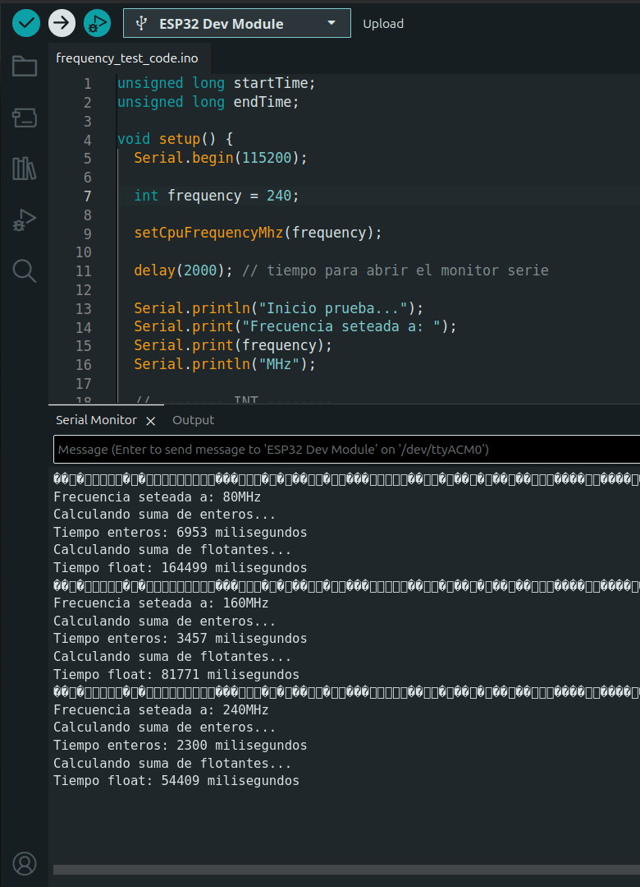

# Análisis del Impacto de la Frecuencia de CPU en el Tiempo de Ejecución sobre ESP32

## 1. Introducción

El rendimiento de un sistema computacional está estrechamente ligado a la frecuencia de operación de su unidad central de procesamiento (CPU). En términos generales, un aumento en la frecuencia permite ejecutar una mayor cantidad de instrucciones por unidad de tiempo, lo que debería traducirse en una reducción del tiempo de ejecución de los programas.

El presente trabajo tiene como objetivo analizar empíricamente esta relación utilizando un microcontrolador ESP32, evaluando cómo varía el tiempo de ejecución de un mismo programa al modificar la frecuencia de operación. Asimismo, se busca comparar el comportamiento de distintos tipos de operaciones aritméticas, particularmente entre operaciones con enteros y con números en punto flotante.

---

## 2. Objetivos

### 2.1 Objetivo general

- Analizar la relación entre la frecuencia de CPU y el tiempo de ejecución de un programa.

### 2.2 Objetivos específicos

- Medir el tiempo de ejecución de un conjunto de instrucciones a distintas frecuencias.
- Evaluar la proporcionalidad entre frecuencia y tiempo de ejecución.
- Comparar el costo computacional de operaciones con enteros y con punto flotante.
- Identificar posibles desviaciones respecto del comportamiento teórico esperado.

---

## 3. Entorno experimental

- **Plataforma hardware:** ESP32  
- **Entorno de desarrollo:** Arduino IDE  
- **Lenguaje de programación:** C/C++ (framework Arduino)

El ESP32 permite modificar dinámicamente su frecuencia de operación, lo cual lo convierte en una plataforma adecuada para este tipo de experimentos.

---

## 4. Metodología

### 4.1 Descripción del experimento

Se diseñó un programa que ejecuta dos bloques de instrucciones diferenciados:

1. Un bucle que realiza sumas de números enteros.
2. Un bucle que realiza operaciones con números en punto flotante.

Ambos bloques consisten en una gran cantidad de iteraciones, con el objetivo de obtener tiempos de ejecución medibles y comparables.

El tiempo de ejecución se mide utilizando la función `millis()`, que retorna el tiempo transcurrido desde el inicio del programa en milisegundos.

---

### 4.2 Código implementado

El codigo implementado en esta prueba se encuntra en el directorio `./frequency_test_code/frequency_test_code.ino`.

Se utilizó la palabra clave `volatile` para evitar optimizaciones del compilador que pudieran eliminar o simplificar los cálculos.

---

### 4.3 Procedimiento

El experimento se llevó a cabo ejecutando el mismo programa bajo distintas configuraciones de frecuencia del microcontrolador:

- 80 MHz
- 160 MHz
- 240 MHz

Para cada configuración, se registraron los tiempos de ejecución correspondientes a ambos tipos de operaciones.

---

## 5. Resultados

A continuación se presentan los resultados obtenidos experimentalmente.

| Frecuencia (MHz) | Tiempo enteros (ms) | Tiempo float (ms) |
| ---------------- | ------------------- | ----------------- |
| 80               |6953                 |164499             |
| 160              |3456                 |81772              |
| 240              |2300                 |54409              |

---
## 6. Análisis de resultados

A partir de los datos experimentales obtenidos, se observa una clara disminución en el tiempo de ejecución a medida que aumenta la frecuencia del microcontrolador.

### 🔹 Relación frecuencia–tiempo

Para operaciones con enteros:

- 80 MHz → 6953 ms  
- 160 MHz → 3456 ms  
- 240 MHz → 2300 ms  

Se verifica que al duplicar la frecuencia (de 80 MHz a 160 MHz), el tiempo de ejecución se reduce aproximadamente a la mitad:

$$
\frac{6953}{3456} \approx 2.0119
$$

Asimismo, al incrementar la frecuencia de 80 MHz a 240 MHz (factor 3), el tiempo se reduce aproximadamente en la misma proporción:

$$
\frac{6953}{2300} \approx 3.0230
$$

Para operaciones con punto flotante:

- 80 MHz → 164499 ms  
- 160 MHz → 81772 ms  
- 240 MHz → 54409 ms  

Se observa el mismo comportamiento:

$$
\frac{164499}{81772} \approx 2.0117
$$

$$
\frac{164499}{54409} \approx 3.0234
$$

Estos resultados indican una relación aproximadamente inversa entre la frecuencia de CPU y el tiempo de ejecución.

---

### 🔹 Comparación entre enteros y punto flotante

Se observa una diferencia significativa entre los tiempos de ejecución de ambos tipos de operaciones.

Por ejemplo, a 80 MHz:

- Enteros: 6953 ms  
- Float: 164499 ms  

Esto implica que las operaciones en punto flotante son aproximadamente:

$$
\frac{164499}{6953} \approx 23.66
$$

veces más costosas que las operaciones con enteros.

Este comportamiento se mantiene en todas las frecuencias, lo que sugiere que el costo relativo de las operaciones es independiente de la frecuencia de CPU.

## 6.1 Análisis de Speedup

Con el objetivo de cuantificar la mejora de rendimiento al incrementar la frecuencia de la CPU, se calculó el *speedup* tomando como referencia la ejecución a 80 MHz.

El speedup se define como:

$$
Speedup = \frac{T_{base}}{T_{nuevo}}
$$

donde:
- $$T_{base}$$ es el tiempo de ejecución a 80 MHz
- $$T_{nuevo}$$ es el tiempo de ejecución a una frecuencia mayor

---

### 🔹 Speedup para operaciones con enteros

| Frecuencia (MHz) | Tiempo (ms) | Speedup |
|------------------|------------|---------|
| 80               | 6953       | 1.00    |
| 160              | 3456       | 2.01    |
| 240              | 2300       | 3.02    |

---

### 🔹 Speedup para operaciones con punto flotante

| Frecuencia (MHz) | Tiempo (ms) | Speedup |
|------------------|------------|---------|
| 80               | 164499     | 1.00    |
| 160              | 81772      | 2.01    |
| 240              | 54409      | 3.02    |

---

### 🔹 Interpretación

Los resultados muestran que el speedup obtenido es prácticamente proporcional al incremento de la frecuencia:

- Al duplicar la frecuencia (80 → 160 MHz), el speedup es ≈ 2  
- Al triplicar la frecuencia (80 → 240 MHz), el speedup es ≈ 3  

Esto indica un escalamiento casi ideal, donde el sistema aprovecha de manera eficiente el aumento de frecuencia sin pérdidas significativas de rendimiento.

Además, se observa que el comportamiento es consistente tanto para operaciones con enteros como para operaciones en punto flotante, lo que sugiere que el factor dominante en el rendimiento es la frecuencia de CPU, independientemente del tipo de operación.

---

### 🔹 Eficiencia del escalamiento

La eficiencia puede estimarse como:

$$
Eficiencia = \frac{Speedup\ observado}{Speedup\ ideal}
$$

Dado que:
- Speedup ideal (160 MHz) = 2  
- Speedup observado ≈ 2.01  

- Speedup ideal (240 MHz) = 3  
- Speedup observado ≈ 3.02  

Se concluye que la eficiencia del sistema es cercana al 100%, lo cual indica un comportamiento altamente eficiente y alineado con el modelo teórico.

## 7. Discusión

Los resultados obtenidos se alinean fuertemente con el modelo teórico esperado, según el cual el tiempo de ejecución de un programa es inversamente proporcional a la frecuencia de la CPU, siempre que la cantidad de instrucciones ejecutadas se mantenga constante.

En este experimento, tanto para operaciones con enteros como con punto flotante, se verificó que al duplicar la frecuencia del procesador, el tiempo de ejecución se reduce aproximadamente a la mitad. Asimismo, al triplicar la frecuencia, el tiempo se reduce en un factor cercano a tres. Esto indica que el sistema se comporta de manera casi ideal, con una eficiencia cercana al 100% respecto al escalamiento de frecuencia.

Por otro lado, se evidenció una diferencia significativa en el costo computacional entre operaciones con enteros y en punto flotante. Las operaciones con números en punto flotante resultaron aproximadamente 23 veces más lentas que las operaciones enteras.

Este comportamiento puede atribuirse a la mayor complejidad de las operaciones en punto flotante, que requieren más ciclos de reloj y, en algunos casos, el uso de unidades de hardware específicas (FPU). A pesar de que el ESP32 dispone de soporte para operaciones en punto flotante, estas continúan siendo considerablemente más costosas que las operaciones enteras.

Finalmente, no se observaron desviaciones significativas respecto al comportamiento teórico, lo que sugiere que factores como memoria, caché u otros cuellos de botella no tuvieron un impacto relevante en este experimento.

## 10. Conclusión

A partir de los resultados obtenidos, se puede concluir que existe una relación inversamente proporcional entre la frecuencia de la CPU y el tiempo de ejecución de un programa en el microcontrolador ESP32.

El análisis experimental demostró que al duplicar la frecuencia de operación, el tiempo de ejecución se reduce aproximadamente a la mitad, mientras que al triplicarla, el tiempo disminuye en una proporción similar. Esto confirma el comportamiento esperado desde el punto de vista teórico.

Asimismo, se evidenció que las operaciones en punto flotante presentan un costo computacional significativamente mayor que las operaciones con enteros, siendo aproximadamente 23 veces más lentas en este experimento. Esta diferencia se mantiene constante independientemente de la frecuencia utilizada.

En conjunto, los resultados validan el modelo teórico de escalamiento del rendimiento en función de la frecuencia, y destacan la importancia del tipo de operación en el análisis del desempeño de sistemas embebidos.
