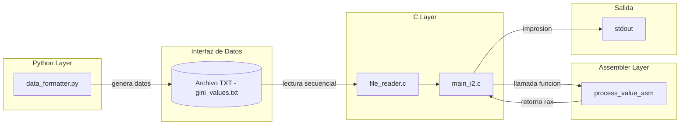
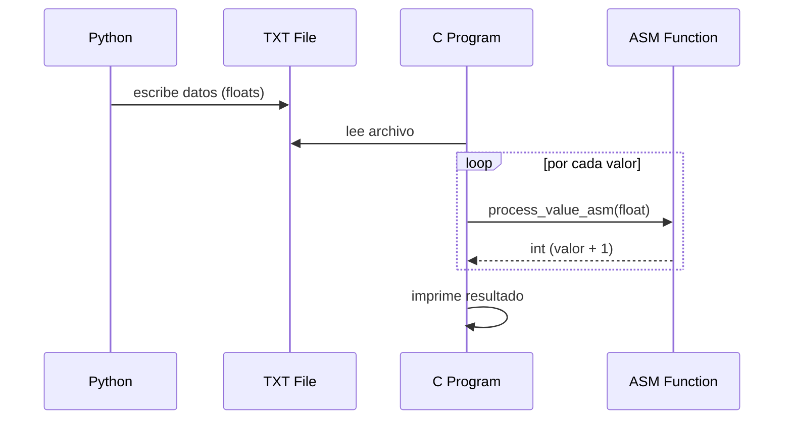
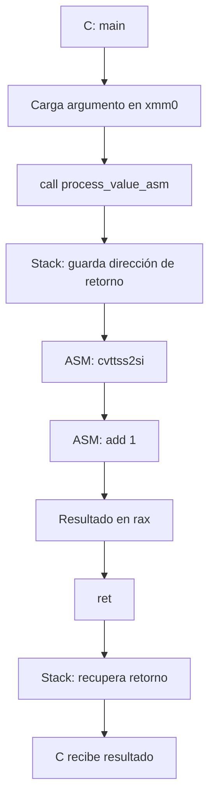

# TP2 – Calculadora de Índices (Integración Python + C + ASM)

## 1. Introducción

El objetivo de este trabajo práctico es implementar un sistema que integre múltiples capas de software:

- Python (obtención y formateo de datos)
- C (procesamiento principal)
- Assembler (operación de bajo nivel)

El foco del TP no está únicamente en el cálculo en sí, sino en:

- la integración entre lenguajes
- el uso de convenciones de llamadas
- el análisis del comportamiento en ejecución mediante debugging


## 2. Arquitectura del sistema

El sistema implementado sigue la siguiente arquitectura:
```bash
Python → archivo .txt → C → ASM → Output
```

### Flujo:

1. Python obtiene/genera datos y los guarda en un archivo `.txt`
2. C lee el archivo y parsea los valores a `float`
3. C invoca una función en assembler (`process_value_asm`)
4. ASM procesa el valor y retorna el resultado
5. C imprime el resultado final


## 3. Decisiones de diseño

### 3.1 Uso de archivo como interfaz

Se decidió desacoplar Python y C mediante un archivo `.txt`:

**Ventajas:**
- simplicidad de integración
- independencia entre capas
- facilidad de testing

### 3.2 Uso de Assembler

Se migró una operación simple a assembler:

```asm
cvttss2si %xmm0, %eax
add $1, %eax
```
Esto permite:

- demostrar paso de parámetros por registros
- analizar ejecución a bajo nivel
- integrar ASM con C real

## 4. Implementacion

### 4.1 Capa Python

Responsable de:

- generar datos
- escribir archivo `data/gini_values.txt`

Ejemplo de ejecución:

```bash
python3 python/data_formatter.py
```

### 4.2 Capa C

Responsable de:

- leer archivo
- convertir strings a float
- iterar sobre los valores
- invocar ASM

Fragmento relevante:

```bash
float value = data[i];
int result = process_value_asm(value);
```
### 4.3 Capa Assembler

```bash
process_value_asm:
    cvttss2si %xmm0, %eax
    add $1, %eax
    ret
```

Explicación:
-`xmm0`: contiene el float recibido desde C
- `cvttss2si`: convierte float → int (truncado)
- `add`: suma 1
- `rax`: contiene el valor de retorno

---

## 5. Debugging con GDB

Se utilizó GDB para analizar la ejecución. Todo el analisis con los resultados del mismo se encuentran en `docs/gbd_analysis.md`


---

## 6. Testing funcional

Se validaron distintos casos:

| Input             | Output esperado |
| ----------------- | --------------- |
| [1.0, 2.0, 3.0]   | [2, 3, 4]       |
| [0.0, 0.0, 100.0] | [1, 1, 101]     |
| [-1.5, 2.3]       | [-1, 3]         |

### Observación

La conversión usa truncamiento (`cvttss2si`), no redondeo.

---

## 7. Benchmarking

Se compararon tiempos de ejecución:

```bash
time python3 python/process_value.py
time ./c/program
```

### Resultados esperados

| Implementación | Performance |
| -------------- | ----------- |
| Python         | más lento   |
| C              | más rápido  |
| C + ASM        | similar a C |

---

### Conclusión

* el mayor costo está en I/O
* el impacto de ASM es bajo (esperado)
* el objetivo del ASM es educativo, no optimización real

---

## 8. Profiling

Se utilizó `gprof`:

```bash
gcc -pg c/*.c c/process_value.s -o c/program
./c/program
gprof c/program gmon.out > analysis.txt
```

### Observaciones

* mayor costo en lectura de archivo
* `process_value_asm` es muy liviana

---

## 9. Diagramas

### 9.1 Diagrama de bloques


El sistema se organiza en capas claramente desacopladas:

- **Python Layer**: responsable de la obtención y formateo de datos.
- **Interfaz de Datos**: archivo `.txt` utilizado como mecanismo de comunicación entre lenguajes.
- **C Layer**: maneja la lógica de lectura, iteración y control del flujo.
- **Assembler Layer**: implementa una operación puntual de procesamiento a bajo nivel.
- **Salida**: resultados impresos por consola.

Esta arquitectura permite separar responsabilidades y facilita tanto el testing como el debugging de cada componente de manera independiente.

### 9.2 Diagrama de secuencia


### 9.3 Flujo de llamada C → ASM


Este diagrama representa el flujo de ejecución a bajo nivel durante la llamada desde C a la función en assembler:

1. **Carga de argumento**  
   El valor `float` se pasa desde C al registro `xmm0`, siguiendo la convención System V AMD64.

2. **Instrucción `call`**  
   Se invoca la función `process_value_asm`.  
   En este punto, la CPU automáticamente guarda la dirección de retorno en el stack (`rsp`).

3. **Ejecución en ASM**  
   - `cvttss2si`: convierte el valor de `float` a entero (truncamiento)  
   - `add`: incrementa el valor en 1  

4. **Valor de retorno**  
   El resultado se almacena en el registro `rax`, que es el estándar para retorno de funciones.

5. **Instrucción `ret`**  
   Se recupera la dirección previamente almacenada en el stack y se retorna a la función en C.

#### Observación importante

Aunque la función ASM no utiliza explícitamente el stack (no hay uso de `rbp` ni variables locales), el stack participa implícitamente en:

- almacenamiento de la dirección de retorno (`call`)
- recuperación de flujo (`ret`)

Esto fue verificado mediante GDB, inspeccionando el registro `rsp` y el contenido del stack en tiempo de ejecución.

---

## 10. Conclusiones

* Se logró integrar correctamente Python, C y ASM
* Se comprendió la convención de llamadas (System V AMD64)
* Se analizó el stack y registros en ejecución real
* Se validó el comportamiento del sistema end-to-end
* Se utilizó tooling real (GDB, Makefile, profiling)

### Punto clave

El valor del trabajo no está en la operación matemática, sino en:

* la integración de capas
* el análisis a bajo nivel
* la comprensión del flujo de ejecución

---

## 11. Uso del proyecto

### Ejecutar

```bash
make
```

---

### Debug

```bash
make debug
```

---

### Limpiar

```bash
make clean
```