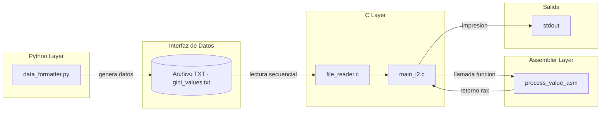
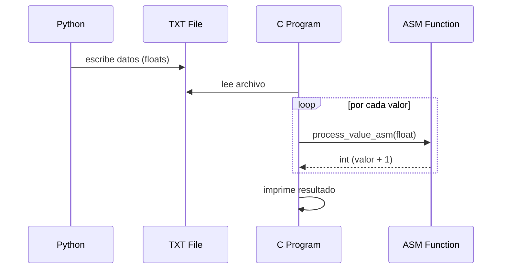
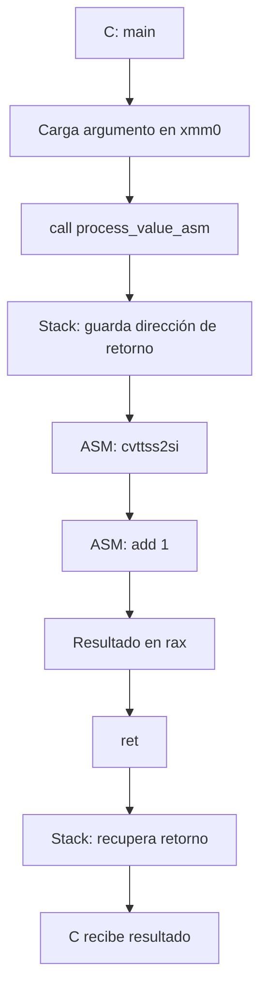

# TP2 – Calculadora de Índices (Integración Python + C + ASM)

## 1. Introducción

El objetivo de este trabajo práctico es implementar un sistema que integre múltiples capas de software:

- Python (obtención y formateo de datos)
- C (procesamiento principal)
- Assembler (operación de bajo nivel)

El foco del TP no está únicamente en el cálculo en sí, sino en:

- la integración entre lenguajes
- el uso de convenciones de llamadas
- el análisis del comportamiento en ejecución mediante debugging

### Estructura del proyecto
```bash
.
├── c/                     # capa intermedia (procesamiento en C + ASM)
│   ├── file_reader.c      # funcion para lectura del .txt
│   ├── file_reader.h      
│   ├── main_i1.c          # main de la primera iretacion (solo C)
│   ├── main_i2.c          # main de la segunda iteracion (C + ASM) 
│   ├── process_value.s   # implementación en assembler
│   └── test_reader.c     # tests de lectura
│
├── python/               # capa superior (API + formateo de datos)
│   ├── api_client.py     # obtencion de los datos del índice de GINI desde la API del Banco Mundial
│   ├── data_formatter.py # extrae los valores usando api_client.py y los almacena en data/gini_values.txt
│   └── main.py
│
├── data/                 # archivos de datos generados
│   └── .gitkeep
│
├── docs/                 # documentación e informes
│   ├── gdb_analysis.md
│   ├── analysis.txt
│   ├── salida_programa.jpeg
│   └── .gitkeep
│
├── Makefile              # automatización de build, run y debug
├── README.md             # documentación general del proyecto
└── .gitignore
```

## 2. Arquitectura del sistema

El sistema implementado sigue la siguiente arquitectura:

```bash
Python → archivo .txt → C → ASM → Output
```

### Flujo:

1. Python obtiene/genera datos y los guarda en un archivo `.txt`
2. C lee el archivo y parsea los valores a `float`
3. C invoca una función en assembler (`process_value_asm`)
4. ASM procesa el valor y retorna el resultado
5. C imprime el resultado final


## 3. Decisiones de diseño

### 3.1 Uso de archivo como interfaz

Se decidió desacoplar Python y C mediante un archivo `.txt`:

**Ventajas:**

- simplicidad de integración
- independencia entre capas
- facilidad de testing

### 3.2 Uso de Assembler

Se migró una operación simple a assembler:

```asm
cvttss2si %xmm0, %eax
add $1, %eax
```

Esto permite:

- demostrar paso de parámetros por registros
- analizar ejecución a bajo nivel
- integrar ASM con C real

## 4. Implementacion

### 4.1 Capa Python

Responsable de:

- generar datos
- escribir archivo `data/gini_values.txt`

Ejemplo de ejecución:

```bash
python3 python/data_formatter.py
```

### 4.2 Capa C

Responsable de:

- leer archivo
- convertir strings a float
- iterar sobre los valores
- invocar ASM

Fragmento relevante:

```bash
float value = data[i];
int result = process_value_asm(value);
```

### 4.3 Capa Assembler

```bash
process_value_asm:
    cvttss2si %xmm0, %eax
    add $1, %eax
    ret
```

Explicación:
-`xmm0`: contiene el float recibido desde C

- `cvttss2si`: convierte float → int (truncado)
- `add`: suma 1
- `rax`: contiene el valor de retorno

---

## 5. Debugging con GDB

Se utilizó GDB para analizar la ejecución. Todo el analisis con los resultados del mismo se encuentran en `docs/gbd_analysis.md`

---

## 6. Testing funcional

Se realizó la validación del sistema completo utilizando la automatización provista por el Makefile. Esta prueba confirma la correcta integración de las tres capas (Python, C y Assembler) y la estabilidad de la comunicación mediante archivos y registros.
Ejecución y Evidencia

Al ejecutar el comando make, el sistema compila los fuentes de Assembler y C, y lanza el ejecutable que procesa los datos reales del Banco Mundial.

 


Como se observa en la captura, el sistema arroja la confirmación `C layer OK` y procede a listar los índices GINI procesados.

| Input (Dataset.txt) | Logica Aplicada (ASM)| Resultado en Consola | Estado |
| -----------------   | -------------------- | -------------------- | ------ |
| GINI Argentina (aprox. 42.3)    | float → int (42) + 1            | 43    |PASSED
| GINI Otros (aprox. 43.1)  | float → int (43) + 1        | 44  | PASSED
| GINI Otros (aprox. 41.9)        | float → int (41) + 1            |42 |PASSED

### Observación

- Se validó que la instrucción `cvttss2si` en la capa de Assembler realiza el truncamiento correcto de los valores de punto flotante antes de realizar el incremento unitario.

- El flujo `Python → .txt → C` funcionó sin errores de lectura, confirmando que el formateo de datos en la capa superior es compatible con el parseo en C.

- La consistencia de los resultados confirma que los parámetros viajan correctamente a través del registro `%xmm0` y retornan por `%rax`, cumpliendo con la normativa System V AMD64 ABI.

---

## 7. Benchmarking

Utilizando:

```bash
time python3 python/process_value.py
time ./c/program
```

Se midió el tiempo total de ejecución de los bloques actuales del sistema utilizando el comando `time`.

| Implementación | Tiempo promedio |
|--------------|----------------|
| Python (API + parseo + salida) | 0.702 s |
| C puro | 0.0053 s |
| C + ASM | 0.0013 s |

### Observaciones

- Python presenta mayor tiempo total debido al consumo de API y parseo de datos.
- Las implementaciones nativas en C reducen drásticamente el tiempo de ejecución.
- La versión con Assembler obtuvo el mejor tiempo promedio.
- Dado el tamaño reducido del dataset y tiempos muy bajos, las diferencias entre C y C + ASM deben interpretarse como orientativas.
- El mayor valor del uso de ASM en este TP es educativo e integrador, más que una optimización crítica.

---

### Conclusión

- el mayor costo está en I/O
- el impacto de ASM es bajo (esperado)
- el objetivo del ASM es educativo, no optimización real

---

## 8. Profiling

Se utilizó `gprof`:

```bash
gcc -pg c/*.c c/process_value.s -o c/program
./c/program
gprof c/program gmon.out > analysis.txt
```

### Observaciones

- Se logró desacoplar la obtención de datos (Python), la lógica de control (C) y el cálculo de bajo nivel (ASM). El uso de un archivo `.txt` como interfaz permitió una integración limpia, aunque con un costo de latencia predecible.

- Si bien la implementación en C + ASM es drásticamente más rápida que la de Python (0.0013s vs 0.702s), el profiling con `gprof` reveló que el sistema está limitado por la Entrada/Salida (I/O). La función de lectura de archivos es la que domina el tiempo de ejecución en la capa nativa, mientras que el cálculo en Assembler es prácticamente instantáneo para los ciclos de la CPU.

- El "peso real" de la función `process_value_asm` resultó ser despreciable en el reporte de profiling (0.00s). Esto demuestra que el uso de instrucciones como `cvttss2si` optimiza al máximo el procesamiento aritmético, confirmando que cualquier cuello de botella remanente no está en el cálculo sino en el pasaje de datos entre capas.

- Mediante el uso de GDB, se validó la convención de llamadas System V AMD64. Se observó correctamente el paso de parámetros por registros (%xmm0 para punto flotante) y la gestión del Stack Frame (uso de %rbp y %rsp) al momento de invocar la rutina en ASM.

El valor de este trabajo no reside en la complejidad de la suma realizada en ASM, sino en la comprensión integral de cómo los datos atraviesan distintas abstracciones de software hasta llegar al hardware. La optimización en bajo nivel es sumamente potente, pero su impacto real depende de cuán eficiente sea la comunicación de datos previa.

Se encuentra la salida del profiling en `docs/analysis.txt`

---

## 9. Diagramas

### 9.1 Diagrama de bloques


El sistema se organiza en capas claramente desacopladas:

- **Python Layer**: responsable de la obtención y formateo de datos.
- **Interfaz de Datos**: archivo `.txt` utilizado como mecanismo de comunicación entre lenguajes.
- **C Layer**: maneja la lógica de lectura, iteración y control del flujo.
- **Assembler Layer**: implementa una operación puntual de procesamiento a bajo nivel.
- **Salida**: resultados impresos por consola.

Esta arquitectura permite separar responsabilidades y facilita tanto el testing como el debugging de cada componente de manera independiente.

### 9.2 Diagrama de secuencia


### 9.3 Flujo de llamada C → ASM


Este diagrama representa el flujo de ejecución a bajo nivel durante la llamada desde C a la función en assembler:

1. **Carga de argumento**  
   El valor `float` se pasa desde C al registro `xmm0`, siguiendo la convención System V AMD64.

2. **Instrucción `call`**  
   Se invoca la función `process_value_asm`.  
   En este punto, la CPU automáticamente guarda la dirección de retorno en el stack (`rsp`).

3. **Ejecución en ASM**  
   - `cvttss2si`: convierte el valor de `float` a entero (truncamiento)  
   - `add`: incrementa el valor en 1  

4. **Valor de retorno**  
   El resultado se almacena en el registro `rax`, que es el estándar para retorno de funciones.

5. **Instrucción `ret`**  
   Se recupera la dirección previamente almacenada en el stack y se retorna a la función en C.

#### Observación importante

Aunque la función ASM no utiliza explícitamente el stack (no hay uso de `rbp` ni variables locales), el stack participa implícitamente en:

- almacenamiento de la dirección de retorno (`call`)
- recuperación de flujo (`ret`)

Esto fue verificado mediante GDB, inspeccionando el registro `rsp` y el contenido del stack en tiempo de ejecución.

---

## 10. Conclusiones

- Se logró integrar correctamente Python, C y ASM
- Se comprendió la convención de llamadas (System V AMD64)
- Se analizó el stack y registros en ejecución real
- Se validó el comportamiento del sistema end-to-end
- Se utilizó tooling real (GDB, Makefile, profiling)

### Punto clave

El valor del trabajo no está en la operación matemática, sino en:

- la integración de capas
- el análisis a bajo nivel
- la comprensión del flujo de ejecución

---

## 11. Uso del proyecto

### Ejecutar

```bash
make
```

---

### Debug

```bash
make debug
```

---

### Limpiar

```bash
make clean
```
