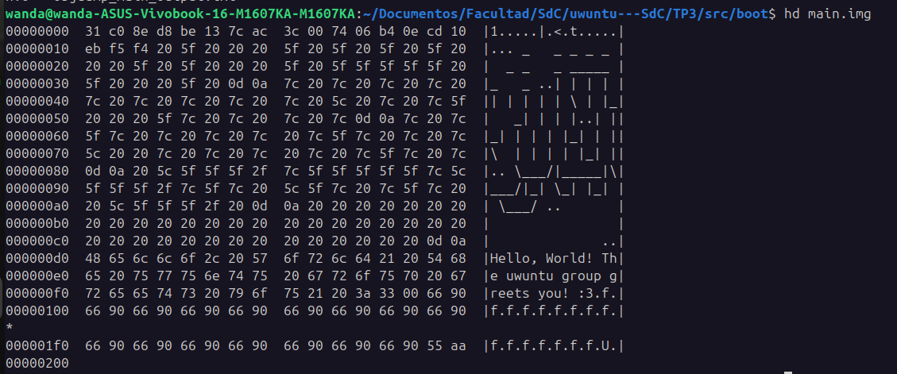
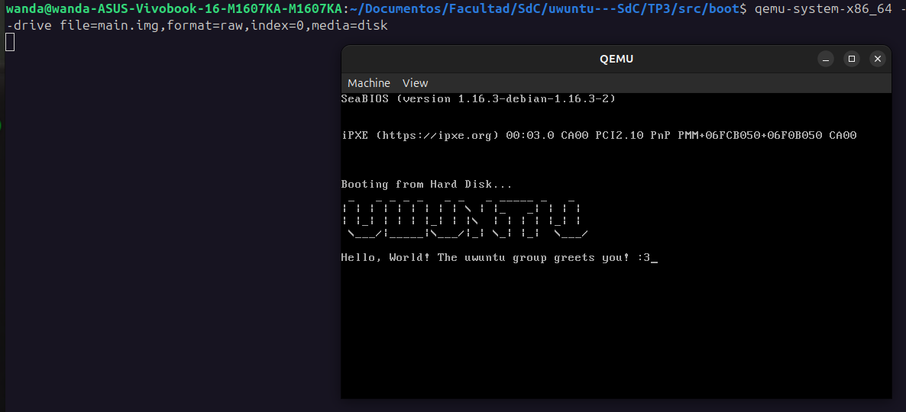
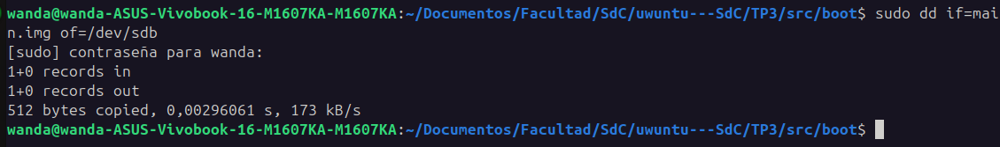
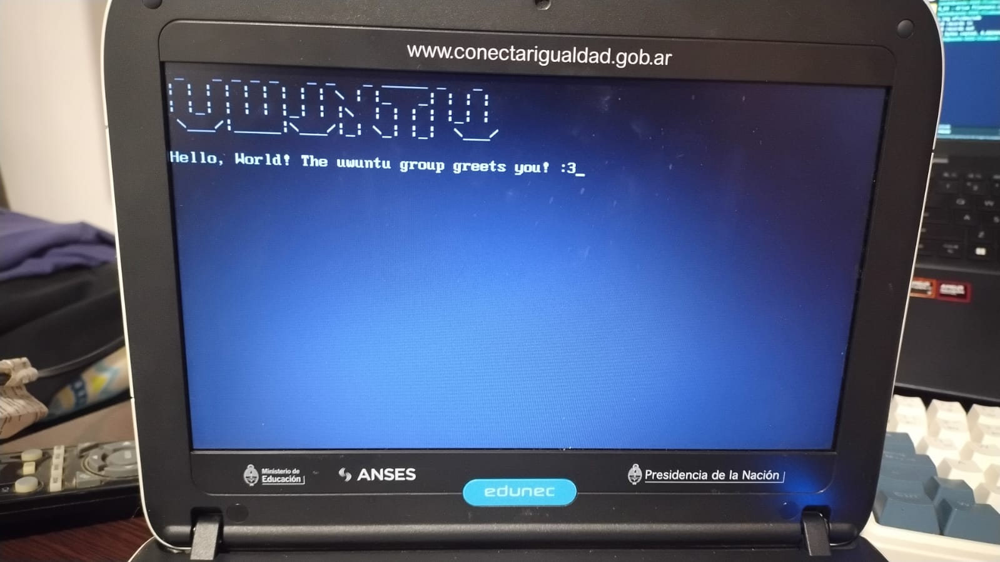

# Generacion de imagen booteable y analisis de linker

## 1. Introducción

El presente trabajo tiene como objetivo analizar y comprender el rol del linker en la generación de ejecutables de bajo nivel dentro de la arquitectura x86, así como validar el proceso completo de construcción de una imagen booteable.

Se implementó un programa en lenguaje assembler que, partiendo desde código fuente, atraviesa todas las etapas del proceso de construcción hasta su ejecución en hardware real. Este flujo puede resumirse como:

```text
ASM → objeto → linking → binario plano → imagen booteable → ejecución
```
El desarrollo se llevó a cabo en modo real, utilizando servicios de BIOS para la salida por pantalla y respetando las restricciones impuestas por el formato de sector de arranque (MBR).

## 2. Marco teórico

En la arquitectura x86, el proceso de arranque comienza cuando el firmware (BIOS) carga el primer sector del dispositivo de almacenamiento en la dirección de memoria `0x7C00` y transfiere el control de ejecución a dicha ubicación.

Este sector, de tamaño fijo (512 bytes), debe cumplir con dos condiciones fundamentales:

- Contener código ejecutable válido
- Finalizar con la firma `0x55AA` en los últimos dos bytes

Dado que en esta etapa no existe sistema operativo ni soporte para formatos ejecutables complejos, el código debe ser provisto en forma de binario plano, sin encabezados ni metadatos adicionales.

## 3. Desarrollo

### 3.1 Implementación en assembler

Se desarrolló un programa en assembler de 16 bits que imprime un mensaje en pantalla utilizando la interrupción de BIOS `int 0x10`, específicamente la función de teletipo (`AH = 0x0E`).

El programa recorre un string terminado en `\0`, imprimiendo carácter por carácter. Para garantizar el correcto acceso a memoria en modo real, fue necesario inicializar explícitamente el registro de segmento de datos (`DS`).

```bash
.code16
.global _start

_start:
    xor %ax, %ax # Clear the AX register
    mov %ax, %ds # Set DS to 0
    mov $msg, %si  # Load the address of the message into SI

print:
    lodsb           # Load the byte at SI into AL and increment SI
    cmp $0, %al     # Check if the byte is null (end of string)
    je done         # If it is null, jump to done

    mov $0x0E, %ah # BIOS teletype function
    int $0x10       # Call BIOS video interrupt to print the character

    jmp print       # Repeat for the next character

done:
    hlt             # Halt the CPU

msg:
.ascii " _   _ _ _ _   _ _   _ _____ _   _ \r\n"
    .ascii "| | | | | | | | | \\ | |_   _| | | |\r\n"
    .ascii "| |_| | | | |_| | |\\  | | | | |_| |\r\n"
    .ascii " \\___/|_____|\\___/|_| \\_| |_|  \\___/ \r\n"
    .ascii "                                     \r\n"
    .ascii "Hello, World! The uwuntu group greets you! :3\0"
```

### 3.2 Generación del archivo objeto

El código fuente fue ensamblado mediante la herramienta `as`, generando un archivo objeto en formato ELF de 32 bits:

```bash
as --32 -o main.o main.S
```

Se puede validar la compilacion viendo la descompilacion generada por `objdump` en el archivo `docs/evidencias/linker/objdump_main_output.txt`

### 3.3 Linking y generación del binario

Para la generación del ejecutable se utilizó un linker script personalizado que define explícitamente el layout del programa en memoria:

```ld
SECTIONS{
    . = 0x7C00;
    .text :
    {
        __start = .;
        *(.text)
        . = 0x1FE;
        SHORT(0xAA55)
    }
}
```

Este script cumple las siguientes funciones:

* Establece la dirección de carga en `0x7C00`, coherente con el comportamiento de la BIOS
* Incluye el código ensamblado en la sección `.text`
* Posiciona la firma de arranque en el offset 510
* Garantiza la validez del sector de arranque

El binario plano fue generado mediante:

```bash
ld -m elf_i386 -T linker.ld --oformat binary -o main.bin main.o
```

## 4. Inspección del binario

Se realizó un análisis comparativo entre la representación simbólica del programa (`objdump`) y su representación en bytes (`hd`).



Imagen 1. Salida del comando `hd main.img`

### 4.1 Análisis

Del análisis se desprende que:

* Existe correspondencia directa entre las instrucciones ensambladas y sus representaciones en hexadecimal
* El código se encuentra ubicado al inicio del binario
* La firma `0x55AA` se encuentra correctamente posicionada en los últimos dos bytes

Esto valida la correcta construcción del ejecutable y su adecuación al formato requerido por la BIOS.


## 5. Ejecución en entorno virtual

La imagen generada fue ejecutada mediante el emulador QEMU:

```bash
qemu-system-x86_64 --drive file=main.img,format=raw,index=0,media=disk
```



Imagen 2. Ejecucion en QEMU.

### 5.1 Resultados

El programa se ejecuta correctamente en el entorno virtual, imprimiendo el mensaje esperado mediante servicios de BIOS.


## 6. Ejecución en hardware real

La imagen fue escrita en un dispositivo USB utilizando la herramienta `dd`:

```bash
sudo dd if=main.img of=/dev/sdb
```



Imagen 3. Carga de la imagen en el usb

Posteriormente, se configuró el sistema para iniciar desde dicho dispositivo.



Imagen 4. Ejecucion del boot en otra computadora

### 6.1 Resultados

El programa se ejecuta correctamente en hardware real, lo que confirma la validez del proceso completo de generación del bootloader.


## 7. Respuestas a las consignas

### 7.1 ¿Qué es un linker? ¿Qué hace?

Un linker es una herramienta que forma parte del proceso de construcción de software y cuya función es combinar uno o más archivos objeto en un único ejecutable.

Sus responsabilidades incluyen:

* Resolución de símbolos
* Asignación de direcciones de memoria
* Organización del layout del programa
* Generación del formato final del ejecutable

En este trabajo, el linker permitió transformar un archivo objeto en un binario plano ejecutable por la BIOS.


### 7.2 ¿Qué representa la dirección en el linker script? ¿Por qué es necesaria?

La dirección definida en el linker script (`0x7C00`) representa la ubicación de memoria donde el programa será cargado y ejecutado.

Esta dirección es necesaria porque:

* La BIOS transfiere el control de ejecución a esa ubicación
* El código debe estar alineado con dicha dirección para que las referencias a memoria sean correctas

Una discrepancia en esta dirección provocaría errores en la ejecución del programa.


### 7.3 Comparación entre `objdump` y `hd`

La herramienta `objdump` permite visualizar el código en formato ensamblador, mientras que `hd` muestra la representación binaria del archivo.

La comparación entre ambas permite verificar:

* La correspondencia entre instrucciones y bytes
* La correcta ubicación del código en el binario
* La presencia de la firma de arranque


### 7.4 ¿Para qué se utiliza `--oformat binary`?

La opción `--oformat binary` instruye al linker a generar un binario plano, es decir, un archivo compuesto exclusivamente por los bytes del programa.

Esto es necesario porque la BIOS no interpreta formatos ejecutables complejos como ELF, sino que carga directamente los bytes del dispositivo de almacenamiento en memoria.


## 8. Problemas encontrados

Durante el desarrollo se identificaron diversos inconvenientes que permitieron profundizar la comprensión del sistema.

### 8.1 Incompatibilidad de arquitectura

Se detectó una incompatibilidad entre el formato del archivo objeto y la arquitectura de salida del linker, resuelta mediante la especificación explícita del formato `elf_i386`.


### 8.2 Escritura incorrecta en el dispositivo

Inicialmente se escribió la imagen sobre una partición en lugar del dispositivo completo, lo que impedía el arranque correcto.


### 8.3 Falta de inicialización del segmento de datos

El programa no funcionaba en hardware real debido a la ausencia de inicialización del registro `DS`, lo que generaba accesos inválidos a memoria.


## 9. Conclusión

El trabajo permitió comprender en profundidad el rol del linker en la construcción de ejecutables de bajo nivel, así como el proceso de arranque en sistemas x86.

La validación del programa tanto en entorno virtual como en hardware real confirma la correcta implementación del flujo completo, desde código assembler hasta su ejecución directa sobre el hardware.

Asimismo, la resolución de los problemas encontrados permitió afianzar conceptos fundamentales relacionados con direccionamiento, formato de binarios y funcionamiento de la BIOS.

