# TP3a - Entorno UEFI, desarrollo y análisis de seguridad

A continuación se presenta el trabajo realizado en este repositorio:

## Preparación del entorno
Se instala el emulador QEMU, el firmware opens source OVMF y la herramienta de compilación cruzada para UEFI y el entorno de ingeniería inversa Ghidra, utilizando los siguientes comandos:

1. Crear un directorio de trabajo

```bash
mkdir -p ~/uefi_security_lab && cd ~/uefi_security_lab
```

2. Instalar las dependencias base:

```bash
sudo apt update
sudo apt install -y qemu-system-x86 ovmf gnu-efi build-essential binutils-mingw-w64
```

3. Instalar de Ghidra:

```bash
sudo apt install -y ghidra || sudo snap install ghidra --classic
```

## Exploración del entorno UEFI y la shell

Se prueba el arranque en el entorno virtual utilizando el siguiente comando:

```bash
qemu-system-x86_64 -m 512 -bios /usr/share/ovmf/OVMF.fd -net none
```

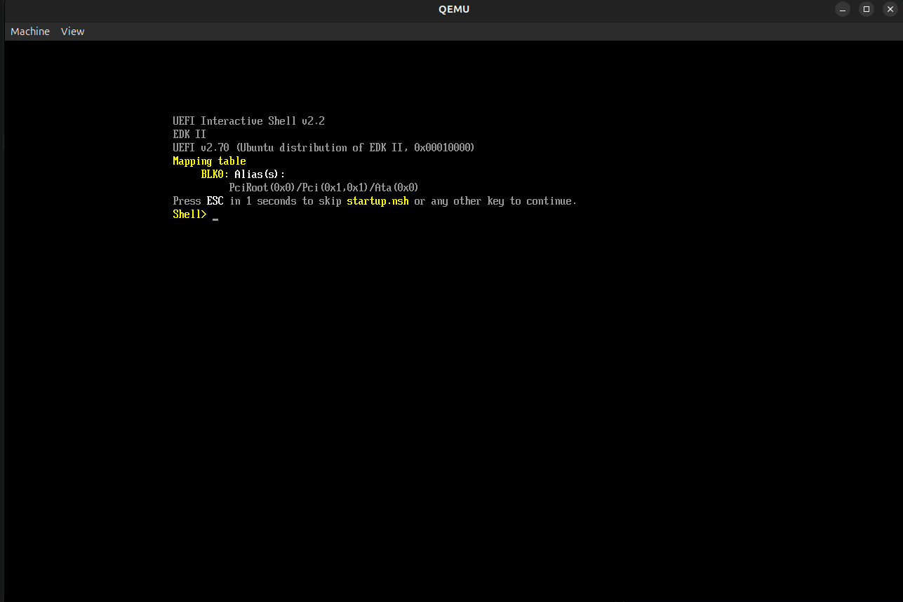

Se prueban los comandos:
```bash
map
devices
devtree
dh -b
```

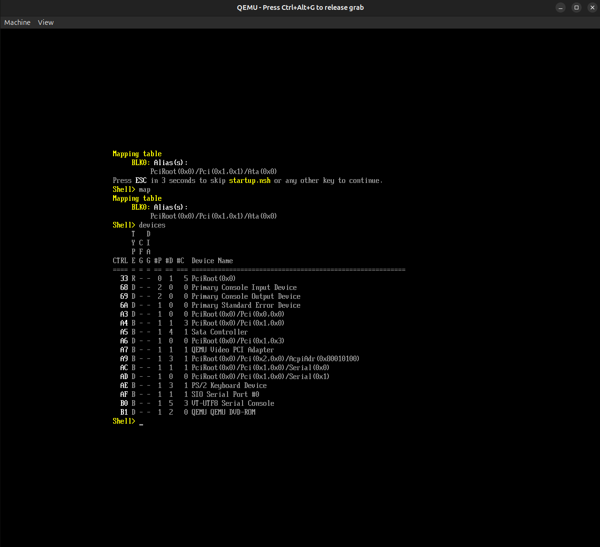

El comando `map` muestra la relación entre dispositivos detectados y sus aliases de acceso. Durante la exploración inicial en la UEFI Shell, se observó que el comando `map` únicamente listaba dispositivos de tipo blk (Block Devices), sin exponer ningún sistema de archivos (fsX). Este comportamiento indica que, si bien el firmware detecta dispositivos de almacenamiento a nivel de bloque, no dispone de un protocolo de tipo Simple File System asociado. Esto ocurre cuando no se provee un medio con un sistema de archivos compatible (por ejemplo FAT32), evidenciando el modelo basado en protocolos de UEFI, donde el acceso a archivos depende de capas de abstracción adicionales por encima del hardware físico.

El comando `devices` lista todos los dispositivos reconocidos por UEFI. Cada entrada es un handle que representa un hardware fisico o dispositivo lógico. Dentro de los dispositivos encontrados tenemos:

- **33 (PciRoot)**: Es el bus principal de tu placa base virtual. Casi todo lo demás cuelga de aquí.

- **68, 69, 6A (Consoles)**: Son los drivers que permiten que veas texto en la pantalla y que el teclado funcione dentro de esta shell.

- **A5 (Sata Controller)**: Es el que gestiona los discos duros.

- **A7 (QEMU Video PCI Adapter)**: La tarjeta gráfica virtual. Es la que está renderizando esa ventana negra.

- **AE (PS/2 Keyboard Device)**: El driver que permite escribir comandos.

- **B1 (QEMU DVD-ROM)**: Unidad de CD/DVD virtual conectada.

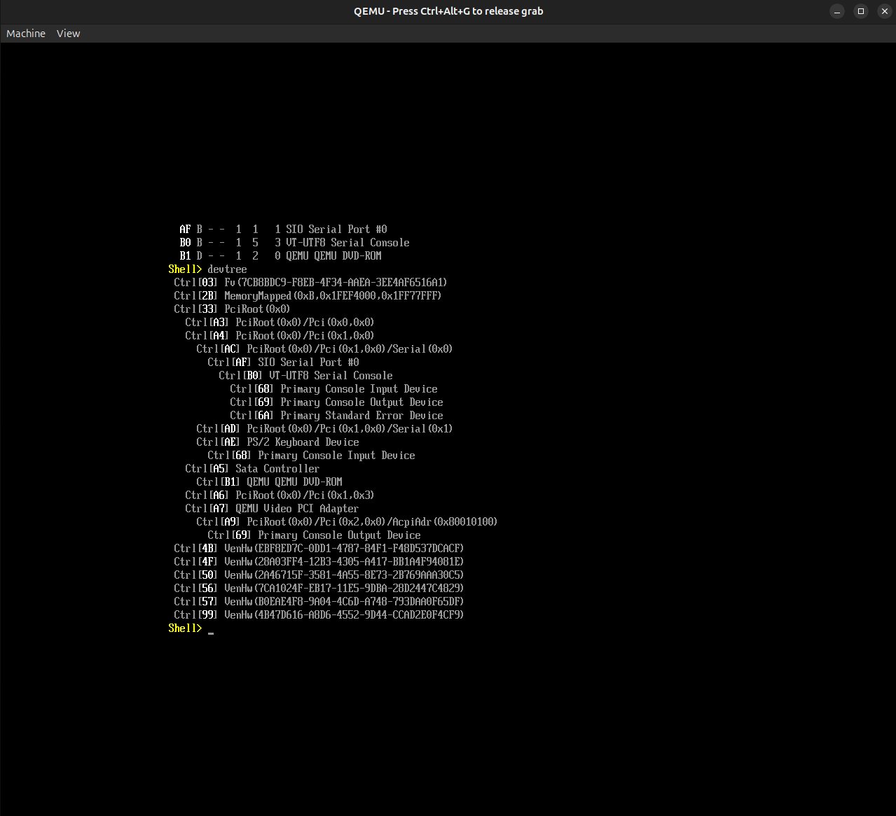

El comando `devtree` muestra el árbol jerárquico de dispositivos. Refleja como estan conectados entre si los dispositivos y de quien depende cada uno. En este caso, podemos ver 3 ramas que nacen del sistema:

### La rama del Bus PCI (Ctrl[33])
Esta es la más importante. Casi todo el hardware virtual de QEMU cuelga de aquí. El Ctrl[A5] (Sata Controller) tiene un hijo, el Ctrl[B1] (QEMU DVD-ROM). Esto confirma que el lector de discos está conectado físicamente al controlador SATA. El Ctrl[A7] (Video Adapter) tiene como hijo al Ctrl[69] (Output Device). Esto significa que la consola que se esta viendo depende directamente de la tarjeta de video. Es curioso ver cómo el Ctrl[AE] (PS/2 Keyboard) cuelga de la jerarquía de bus, y de él nace el Ctrl[68] (Input Device).

### La rama de Comunicaciones (Serial)
Bajo el Ctrl[A4], vemos una cadena interesante:

```text
PciRoot -> Serial(0x0) -> SIO Serial Port -> Serial Console.
```

Esto indica que la UEFI está preparada para redirigir lo que ves a un puerto serial (útil para debuguear desde otra máquina si la pantalla fallara).

### Los nodos "Huérfanos" o de Sistema (VenHw)
Al final se ven varios Ctrl con códigos largos como VenHw(EBF8ED7C-...). Estos son nodos de hardware de fabricante (Vendor Hardware). No son dispositivos físicos como un disco o un mouse, sino rutas de software o variables de la memoria flash de la BIOS que la UEFI necesita para cargar drivers específicos o configuraciones internas.

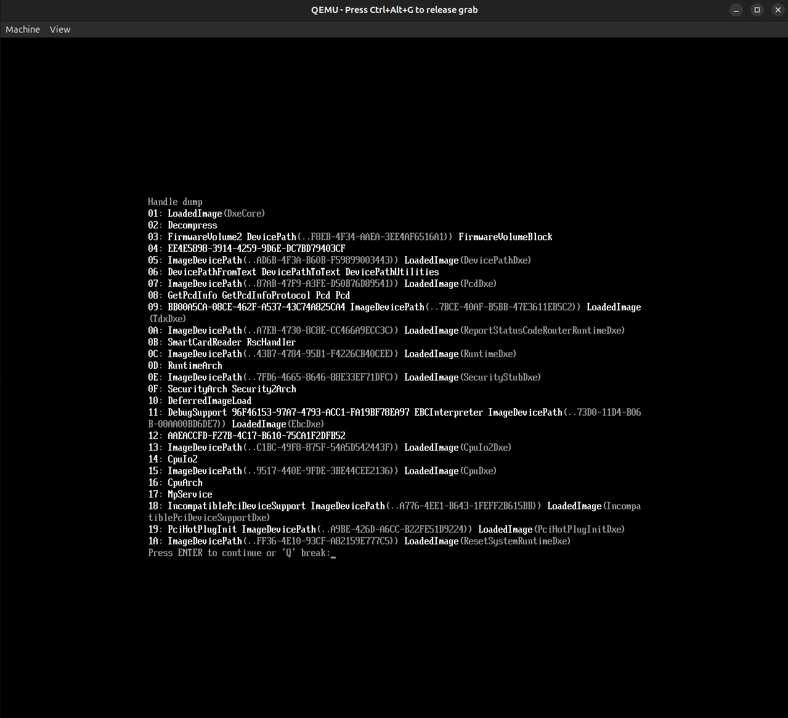

El comando `dh -b` muestra el dump detallado de handles y protocolos asociados. Permite inspeccionar la base de datos interna de UEFI, mostrando cada handle junto con los protocolos que implementa, lo cual constituye el mecanismo fundamental de abstracción del hardware en este entorno.

Analizando las variables globales:

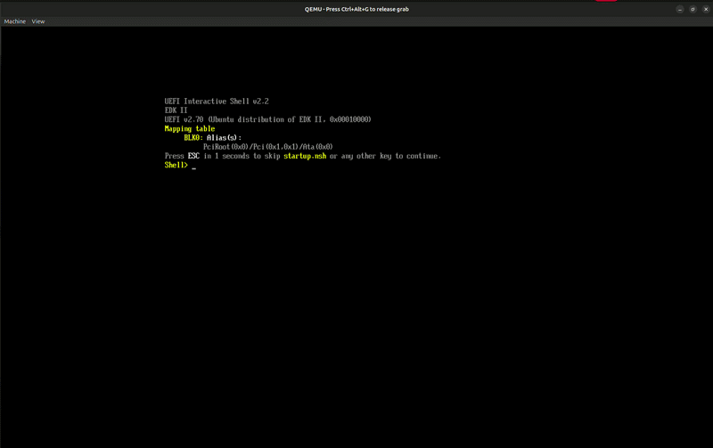

El comando `dmpstore` muestra como entrar a la oficina de registros o al registro de configuracion de UEFI. Este comando muestra todas las variables EFI almacenadas en la memoria NVRAM (la memoria que no se borra al apagar la PC). Es básicamente el lugar donde la computadora anota sus preferencias y datos persistentes. Cada bloque representa una variable y tiene esta estructura:

**1. El nombre y el GUID**
- *Variable Name*: El nombre "humano" de la configuración (por ejemplo, BootOrder, SecureBoot, o PlatformLang).

- *GUID*: Un código larguísimo (como 8BE4DF61-93CA...) que identifica al fabricante o al subsistema que es dueño de esa variable.

**2. Los Atributos (Attributes)**
Se pueden ver unas siglas que indican cómo se comporta esa variable:

- *NV (Non-Volatile)*: Significa que la variable sobrevive a los reinicios (se guarda en un chip físico).

- *BS (Boot Service)*: Indica que solo la UEFI puede verla durante el arranque.

- *RT (Runtime)*: Significa que tu sistema operativo (Linux, Windows) puede leerla o modificarla mientras está encendido.

**3. El Dato (Data)**
Es el valor real de la configuración, mostrado normalmente en Hexadecimal. Por ejemplo, si se mira la variable BootOrder, se ve una serie de números que indican qué disco arranca primero.

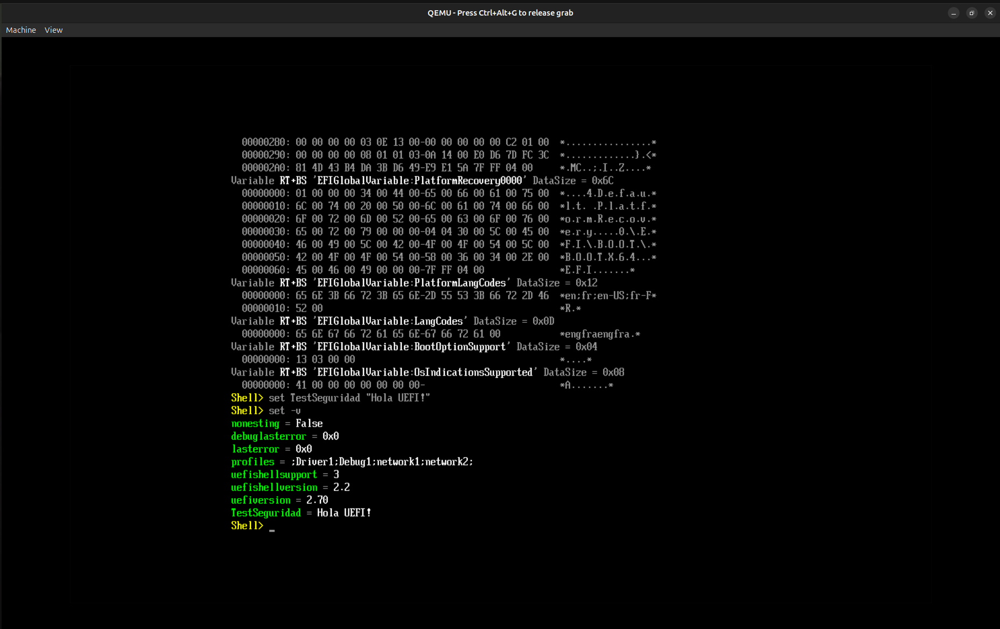

Los dos comandos (`set` y `set -v`) sirven para gestionar variables de entorno dentro de la shell de UEFI. En este caso se setea una variable llamada `TestSeguridad` con el valor "Hola UEFI!". Con `set -v` se muestra una lista de todas las variables de entorno actuales que estan marcadas como volatiles.

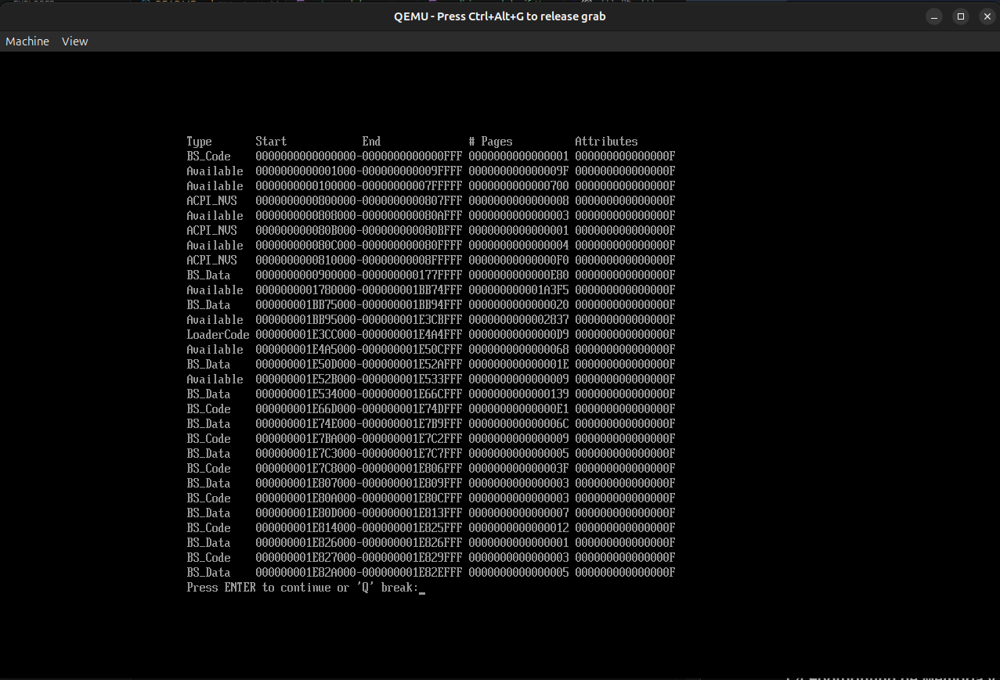

Con el comando `memmap -b` se ve como esta repartida la memoria RAM del sistema en ese momento. Las columnas muestran:

* **Type (Tipo)**: Indica para qué se está usando ese bloque de memoria. Los más comunes son:

    -  *Conventional Memory*: RAM libre y lista para que la use el sistema operativo o aplicaciones.

    - *BS_Data / BS_Code (Boot Services)*: Memoria que usa la UEFI durante el arranque. Una vez que el sistema operativo carga, esta RAM se libera.

    - *RT_Data / RT_Code (Runtime Services)*: Memoria que se mantiene ocupada siempre, incluso después de que cargue el sistema operativo, porque contiene funciones vitales de la BIOS.

    - *Loader Code/Data*: Donde se encuentra cargada la propia Shell o el cargador de arranque.

* **Start / End**: Las direcciones físicas exactas (en hexadecimal) donde empieza y termina ese bloque.

* **# Pages**: El tamaño del bloque medido en páginas (en UEFI, 1 página = 4 KB).

* **Attributes**: Permisos del bloque (UC = Uncacheable, WC = Write Coalescing, etc.).

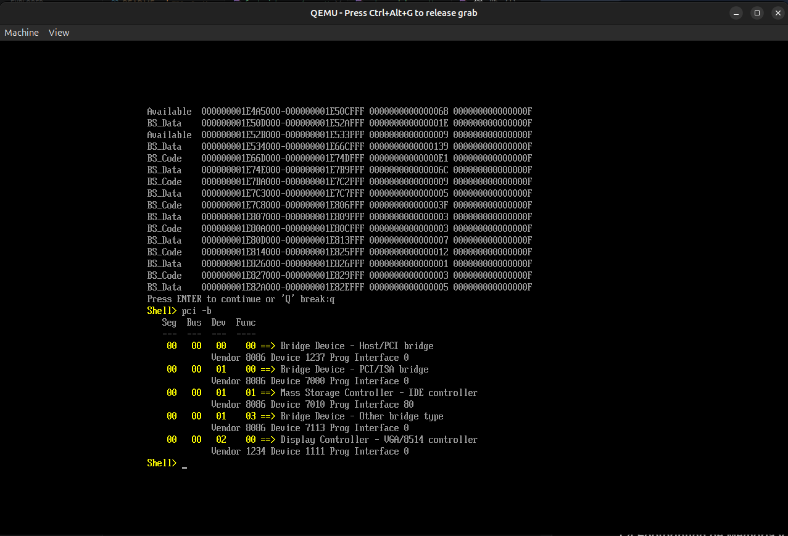

El comando `pci -b` enumera todos los dispositivos conectados al bus PCI. Se muestra una tabla tecnica con columnas:

- **Bus / Dev / Func (B/D/F)**: Es la "dirección postal" del hardware.

    - *Bus*: En qué autopista está.

    - *Dev (Device)*: En qué salida de la autopista se encuentra.

    - *Func (Function)*: Algunos dispositivos hacen varias cosas (ej. una tarjeta que es audio y red a la vez).

- **Vendor ID**: Un código único que identifica al fabricante (ej. 8086 es Intel, 10DE es NVIDIA).

- **Device ID**: Identifica el modelo exacto del componente.

- **Class Code**: Indica qué tipo de dispositivo es (un puente, un controlador de video, un controlador de red, etc.).

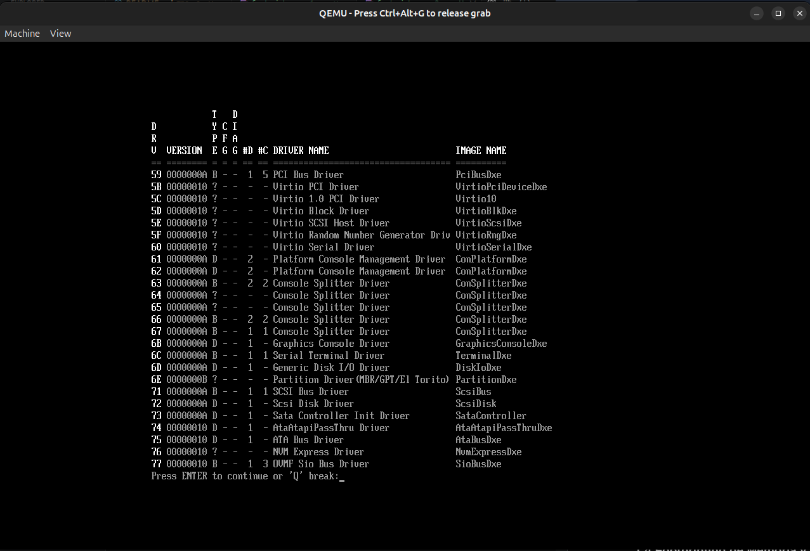

El comando `drivers -b` muestra una lista con todos los drivers cargados en la memoria de la UEFI. Las columnas claves son:

- **DRV (Handle)**: El identificador único del driver en la base de datos de la UEFI.

- **VERSION**: La versión del fabricante del driver (útil para saber si el firmware está actualizado).

- **TYPE**:

    - *B (Bus)*: Controladores que gestionan buses (como el bus PCI o USB).

    - *D (Device)*: Controladores para dispositivos finales.

- **CFG / DIAG**: Indica si el driver ofrece un menú de Configuración o herramientas de Diagnóstico.

- **#D (Devices)**: El número de dispositivos físicos que este driver está controlando actualmente.

- **#C (Children)**: El número de dispositivos hijos que han sido creados por este driver.

- **Driver Name**: El nombre del archivo o del componente (ej: SataController, Partition, OpenSource Keyboard).

## Desarrollo, compilacion y analisis de seguridad

Se crea un archivo fuente en C en `./src/main.c` el cual muestra un Hello Word adaptado al grupo.

```bash
#include <efi.h>
#include <efilib.h>

EFI_STATUS efi_main(EFI_HANDLE ImageHandle, EFI_SYSTEM_TABLE *SystemTable)
{
    InitializeLib(ImageHandle, SystemTable);

    SystemTable->ConOut->OutputString(SystemTable->ConOut, L"\r\n");
    SystemTable->ConOut->OutputString(SystemTable->ConOut, L"=====================================\r\n");
    SystemTable->ConOut->OutputString(SystemTable->ConOut, L"              UWUNTU                 \r\n");
    SystemTable->ConOut->OutputString(SystemTable->ConOut, L"=====================================\r\n");

    SystemTable->ConOut->OutputString(SystemTable->ConOut, L" u     u  w     w  u     u  n   n  ttttt  u     u \r\n");
    SystemTable->ConOut->OutputString(SystemTable->ConOut, L" u     u  w  w  w  u     u  nn  n    t    u     u \r\n");
    SystemTable->ConOut->OutputString(SystemTable->ConOut, L" u     u  w w w w  u     u  n n n    t    u     u \r\n");
    SystemTable->ConOut->OutputString(SystemTable->ConOut, L" u     u  ww   ww  u     u  n  nn    t    u     u \r\n");
    SystemTable->ConOut->OutputString(SystemTable->ConOut, L"  uuuu     w   w    uuuu    n   n    t     uuuuu  \r\n");

    SystemTable->ConOut->OutputString(SystemTable->ConOut, L"\r\n        >>> grupo: uwuntu <<<\r\n\r\n");

    SystemTable->ConOut->OutputString(SystemTable->ConOut, L"Iniciando entorno pre-OS...\r\n");
    SystemTable->ConOut->OutputString(SystemTable->ConOut, L"Firmware activo. Protocolos cargados.\r\n");
    SystemTable->ConOut->OutputString(SystemTable->ConOut, L"Explorando el sistema desde UEFI...\r\n\r\n");

    unsigned char code[] = {0xCC};

    if (code[0] == 0xCC)
    {
        SystemTable->ConOut->OutputString(SystemTable->ConOut, L"[OK] Breakpoint detectado (INT3)\r\n");
    }

    SystemTable->ConOut->OutputString(SystemTable->ConOut, L"\r\nEjecucion finalizada.\r\n");

    return EFI_SUCCESS;
}
```

Para compilar el codigo a formato PE/COFF, se utilizan los siguiente comandos:

1. Compilar el codigo objeto

```bash
gcc -I/usr/include/efi -I/usr/include/efi/x86_64 -I/usr/include/efi/protocol -fpic -ffreestanding -fno-stack-protector -fno-strict-aliasing -fshort-wchar -mno-red-zone -maccumulate-outgoing-args -Wall -c -o uwuntu_app.o uwuntu_app.c
```

Este comando es un compilador configurado para el "espacio profundo". Básicamente, le estás diciendo a gcc que olvide que existe Linux o Windows y que genere código capaz de ejecutarse directamente sobre el hardware (el firmware UEFI).

- `-I...`: Le dice al compilador dónde están las "reglas" de UEFI (cabeceras), ya que no puede usar las de un sistema operativo normal.

- `-fshort-wchar`: Ajusta el tamaño del texto. UEFI usa caracteres de 2 bytes (Unicode), y este comando obliga a C a usar ese formato para que los textos sean legibles.

- `-ffreestanding`: Indica que el programa correrá "solo", sin ayuda de un sistema operativo (sin printf ni librerías estándar).

- `-fpic` y `-mno-red-zone`: Configuran el manejo de memoria y CPU para que el código sea "nómada" (funcione en cualquier dirección de la RAM) y no choque con las interrupciones del firmware.

- `-c`: Solo prepara el código (genera un `.o`), no crea el programa final todavía.

2. Linkear

```bash
ld -shared -Bsymbolic -L/usr/lib -L/usr/lib/efi -T /usr/lib/elf_x86_64_efi.lds /usr/lib/crt0-efi-x86_64.o uwuntu_app.o -o uwuntu_app.so -lefi -lgnuefi
```

Este comando conecta el `.o` con las librerias utilizadas:
- `-shared -Bsymbolic`: Crea un archivo que puede cargarse en cualquier parte de la memoria, asegurando que el programa use sus propias funciones internas antes de buscar afuera.

- `-T /usr/lib/elf_x86_64_efi.lds`: Usa un "script de enlazado". Es el plano que le dice al programa exactamente cómo debe organizarse en la RAM para que la UEFI lo entienda.

- `crt0-efi-x86_64.o`: Es el "punto de entrada". Es un pequeño código que prepara la CPU y luego salta a la función efi_main.

- `-lefi -lgnuefi`: Incluye las librerías con las funciones prefabricadas de UEFI (como InitializeLib).

- `-o uwuntu_app.so`: Genera el resultado final, que en este paso es un archivo de biblioteca compartida (ELF), el cual luego se convertirá en el archivo `.efi` definitivo.

3. Convertir a ejecutable: 

```bash
objcopy -j .text -j .sdata -j .data -j .dynamic -j .dynsym -j .rel -j .rela -j .rel.* -j .rela.* -j .reloc --target=efi-app-x86_64 uwuntu_app.so uwuntu_app.efi
```

En este paso final se utiliza el archivo generado por el enlazador y lo convierte en un programa con formato PE/COFF, que es el unico que UEFI sabe ejecutar:

- `-j .text -j .data ...`: Selecciona solo las partes esenciales del código (instrucciones, datos, variables). Descarta todo lo que sobra (como información de depuración de Linux) para que el archivo sea ligero.

- `-j .reloc`: Incluye la tabla de "relocalización". Esto es lo que permite que el programa funcione sin importar en qué dirección de la memoria RAM lo cargue la UEFI.

- `--target=efi-app-x86_64`: Esta es la clave. Le dice a la herramienta que convierta el formato de Linux (ELF) al formato oficial de Aplicación UEFI de 64 bits.

- `uwuntu_app.so uwuntu_app.efi`: El archivo de entrada y el archivo de salida final.

Analizando los metadatos y la decompilacion:

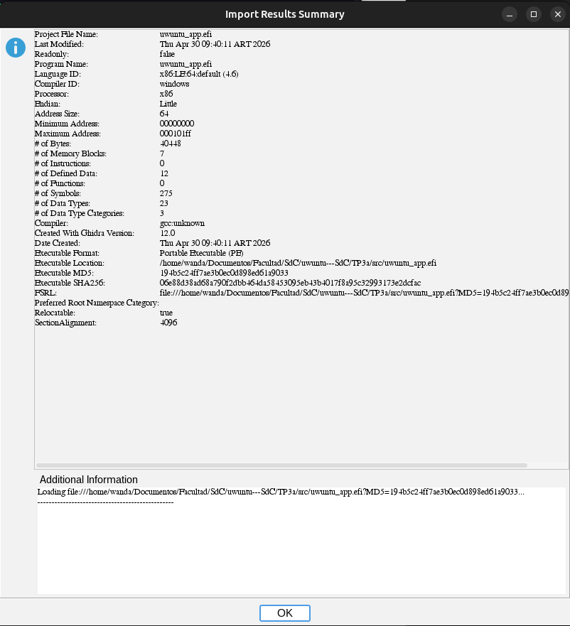

El resumen de importación del archivo uwuntu_app.efi muestra:

- Es un Portable Executable (PE), específicamente una aplicación EFI (usada habitualmente en el arranque de sistemas o drivers de bajo nivel).

- Está compilado para x86 de 64 bits (Little Endian).

- Indica el uso de gcc sobre una base de Windows.

- El archivo pesa 40,448 bytes, tiene 7 bloques de memoria y contiene 275 símbolos, pero curiosamente marca 0 funciones e instrucciones detectadas inicialmente, lo que sugiere que aún no ha sido analizado profundamente por la herramienta.

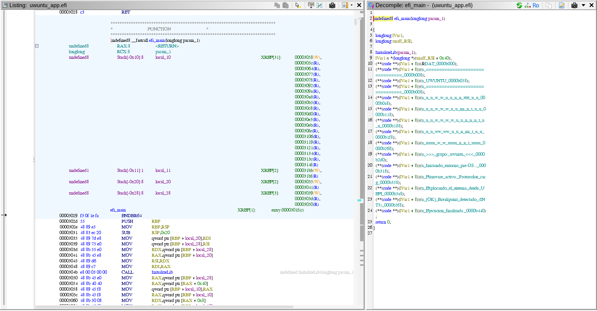

El análisis del binario UEFI mediante Ghidra permitió identificar la función principal `efi_main`, aunque con pérdida de tipado, siendo representada como `undefined8 efi_main`(`longlong param_1`). A través del análisis del código decompilado y ensamblador, se observó que el segundo parámetro (almacenado en el registro RSI) corresponde a la estructura EFI_SYSTEM_TABLE.

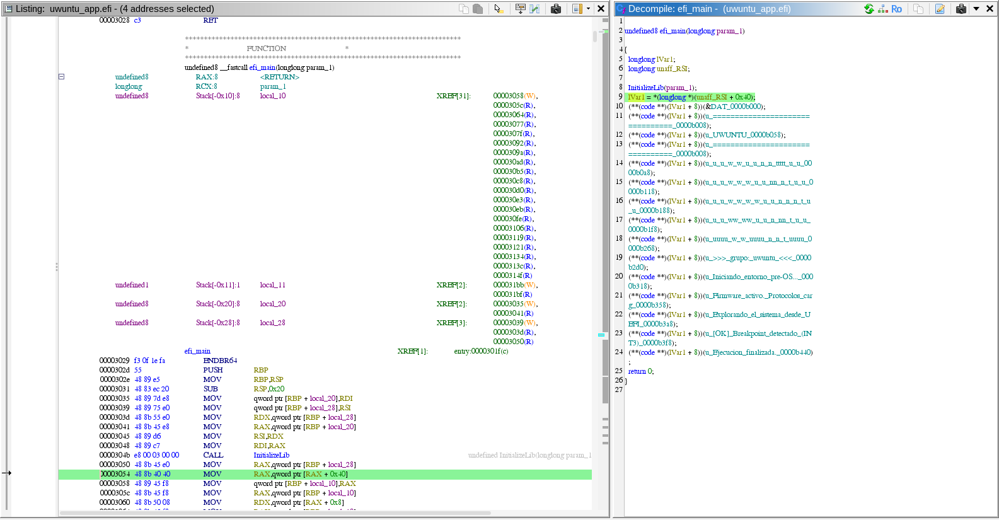

Las llamadas a funciones como OutputString no aparecen de forma directa, sino como invocaciones indirectas mediante punteros a funciones, evidenciado en expresiones del tipo `(**(code **)(ptr + offset))`. Esto refleja el modelo de programación de UEFI basado en protocolos, donde las interfaces se implementan como estructuras con punteros a funciones.

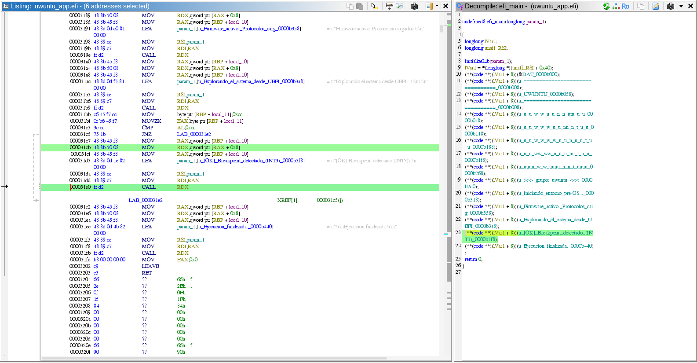

Durante el análisis en Ghidra, no se observa explícitamente la condición asociada al valor `0xCC`. Esto se debe a que el compilador optimizó la expresión en tiempo de compilación, evaluándola como verdadera y eliminando completamente la estructura condicional. Como resultado, el código decompilado presenta únicamente la ejecución directa del bloque asociado, sin ninguna instrucción de salto condicional. Este comportamiento evidencia cómo las optimizaciones pueden ocultar la lógica original del programa, dificultando el análisis en contextos de ingeniería inversa y ciberseguridad.

## Ejecucion en hardware fisico

Para probar el binario compilado en una computadora real, se debe preparar un pendrive para usarlo como medio de arranque:

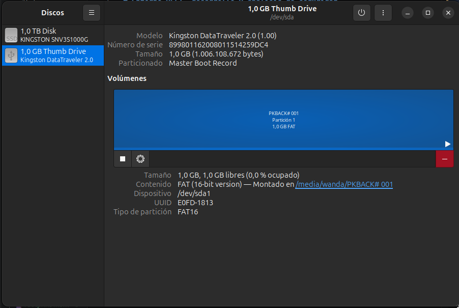

Se identifica al pendrive con la particion `/dev/sda1`. El mismo se formateo en FAT32 (dado a que lo requiere UEFI) con el siguiente comando:

```bash
sudo mkfs.vfat -F 32 /dev/sda1
```

Luego se monta el pendrive con:

```bash
sudo mount /dev/sda1 /mnt
```

Se crea la estrutura estandarizada de directorio:

```bash
sudo mkdir -p /mnt/EFI/BOOT
```

Luego se descarga la UEFI Shell de TianoCore con:

```bash
wget https://github.com/tianocore/edk2/raw/UDK2018/ShellBinPkg/UefiShell/X64/Shell.efi \
-O BOOTX64.EFI
```

Finalmente se copia la aplicacion compilada en el TP2 a la raiz del pendrive:

```bash
sudo cp ~/uefi_security_lab/uwuntu_app.efi /mnt/
sudo sync
sudo umount /mnt
```

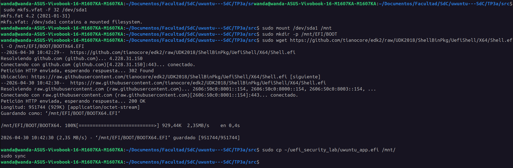

Antes de probarlo en una computadora real, se prueba en QEMU, utilizando los siguientes comandos:

```bash
mkdir -p ~/uefi_test/EFI/BOOT
cp uwuntu_app.efi ~/uefi_test/ # se monta en el backend fat de QEMU

wget https://github.com/tianocore/edk2/raw/UDK2018/ShellBinPkg/UefiShell/X64/Shell.efi \
-O ~/uefi_test/EFI/BOOT/BOOTX64.EFI # usa la UEFI shell 

qemu-system-x86_64 \
  -m 512 \
  -bios /usr/share/ovmf/OVMF.fd \
  -drive format=raw,file=fat:rw:~/uefi_test # ejecuta QEMU

```

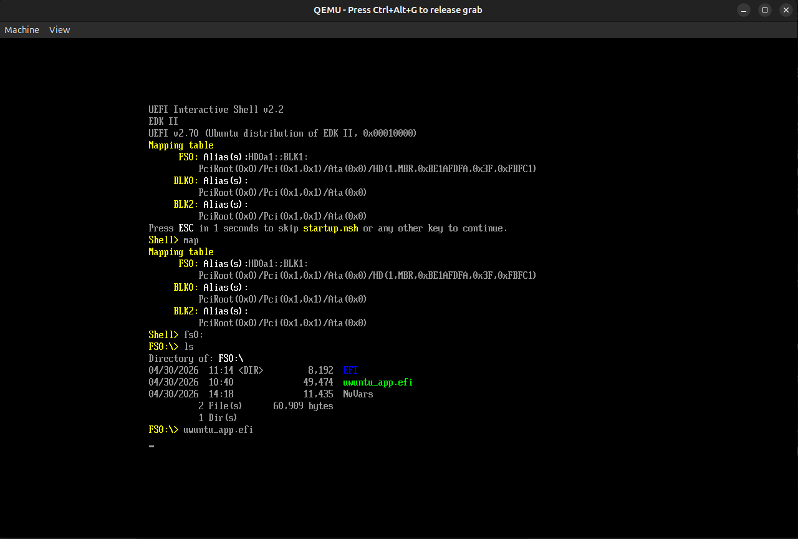

Como se ve, el programa queda "clavado" al ejecutar `uwuntu_app.efi`. Buscando las posibles causas, se encontro que esto se debia al uso de `SystemTable->ConOut->OutputString`. Haciendo una prueba y cambiandolo a `Print`, se obtuvo la siguiente salida:

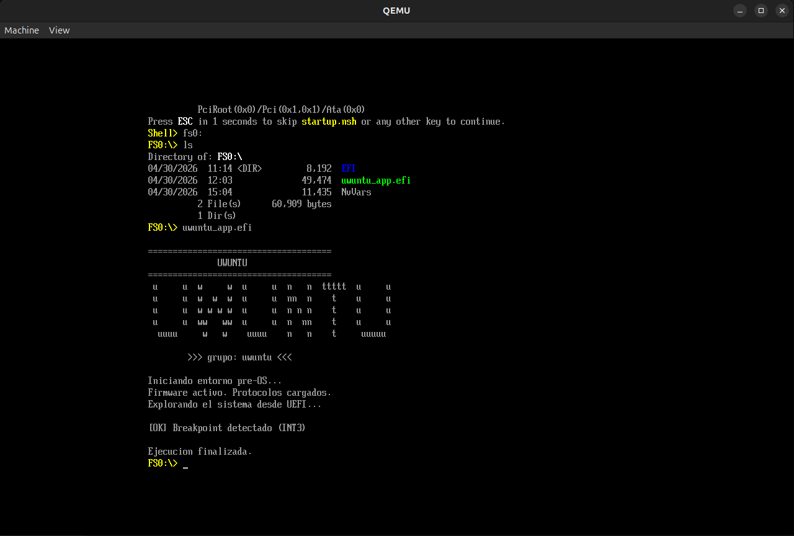


El uso de `Print()` se adoptó como alternativa a `OutputString()` debido a problemas de ejecución observados en el entorno QEMU. Si bien ambas funciones operan sobre los servicios de salida del firmware UEFI, `OutputString()` implica una interacción directa con el protocolo `EFI_SIMPLE_TEXT_OUTPUT_PROTOCOL`, requiriendo que las estructuras y punteros asociados estén correctamente inicializados. Esto la hace más susceptible a fallos en entornos donde la inicialización no es completamente consistente.

Por el contrario, `Print()` es una función de más alto nivel provista por la biblioteca `gnu-efi`, que encapsula el uso de `OutputString()` y gestiona internamente aspectos como el formateo y la validación del contexto. Esta capa adicional de abstracción la vuelve más robusta frente a diferencias entre implementaciones de firmware, permitiendo una ejecución más estable en entornos emulados y reales.

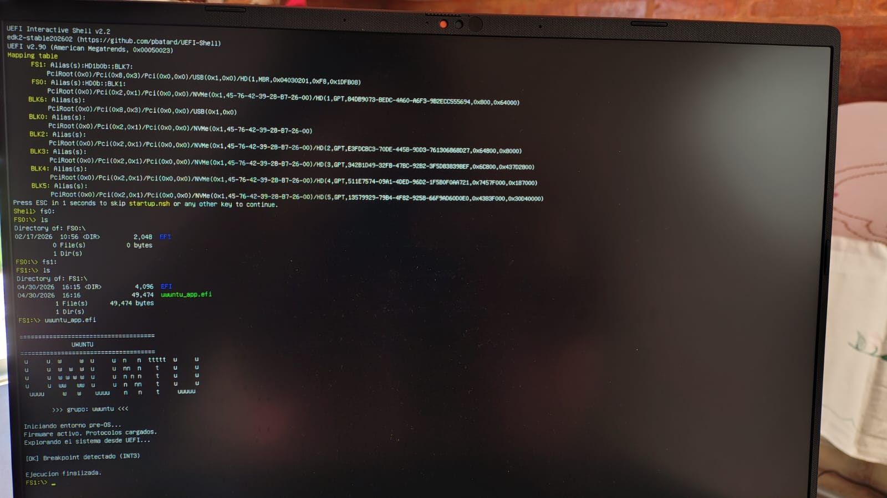

Durante las pruebas en hardware real se detectó que una versión antigua de la UEFI Shell no era correctamente ejecutada por el firmware del equipo (ASUS), provocando un bloqueo en la pantalla inicial. Al reemplazarla por una versión más reciente y compatible, el sistema logró iniciar correctamente. Este comportamiento evidencia diferencias entre implementaciones de firmware y resalta la importancia de utilizar herramientas actualizadas en entornos UEFI reales.

```bash
wget https://github.com/pbatard/UEFI-Shell/releases/latest/download/shellx64.efi \
-O BOOTX64.EFI
```