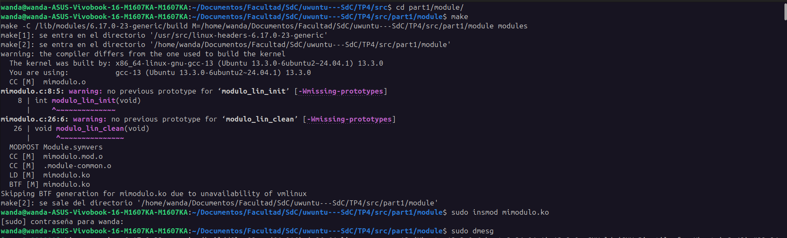
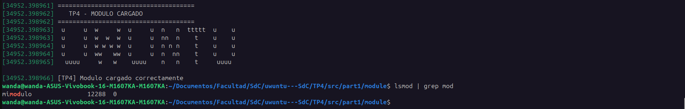
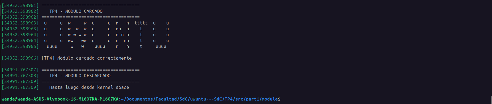
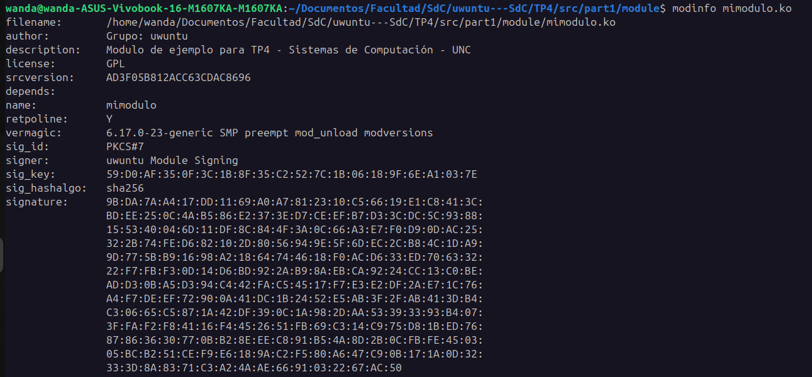

# Desarrollo del módulo y desafíos iniciales

## Sistema operativo utilizado

- Distribución: Ubuntu 24.04 LTS
- Arquitectura: amd64
- Kernel: `uname -r`

## Dependencias instaladas

Para el desarrollo del trabajo práctico se instalaron herramientas necesarias para la compilación de módulos de kernel Linux y generación de paquetes.

Paquetes utilizados:

- `build-essential`
- `checkinstall`
- `linux-headers-$(uname -r)`

Durante la preparación del entorno se observó que el paquete `kernel-package`, mencionado en bibliografía más antigua, ya no se encuentra disponible en Ubuntu 24.04.


## Estructura del módulo

El módulo desarrollado consiste en un módulo simple del kernel Linux implementado en lenguaje C.

La estructura principal del módulo incluye:

- función de inicialización,
- función de limpieza,
- macros de registro del módulo,
- mensajes enviados al log del kernel mediante `printk()`.

### Funciones principales

#### `mimodulo_init`

Se ejecuta cuando el módulo es cargado en el kernel.

Responsabilidades:

- inicializar el módulo,
- imprimir mensajes en el log del kernel,
- registrar evidencia de carga correcta.

#### `mimodulo_exit`

Se ejecuta cuando el módulo es removido.

Responsabilidades:

- liberar recursos utilizados,
- imprimir mensajes de descarga,
- registrar evidencia de finalización.

## Diferencia entre un programa y un módulo

Un programa tradicional se ejecuta en espacio de usuario y depende del kernel para acceder al hardware y a recursos privilegiados mediante llamadas al sistema.

Un módulo de kernel, en cambio:

- se ejecuta directamente en espacio kernel,
- posee privilegios elevados,
- puede interactuar directamente con hardware y estructuras internas del sistema operativo.

Mientras que un fallo en un programa generalmente afecta únicamente al proceso que lo ejecuta, un error en un módulo puede comprometer la estabilidad completa del sistema operativo.

## Espacio de usuario vs espacio kernel

### Espacio de usuario

El espacio de usuario es el entorno donde se ejecutan las aplicaciones comunes.

Características:

- acceso restringido al hardware,
- aislamiento entre procesos,
- protección de memoria,
- necesidad de syscalls para acceder a recursos privilegiados.


### Espacio kernel

El espacio kernel es el entorno privilegiado del sistema operativo.

Características:

- acceso total a memoria y hardware,
- control de drivers y dispositivos,
- manejo de interrupciones,
- administración de procesos y memoria.

Los módulos de kernel se ejecutan dentro de este espacio privilegiado.

## Espacio de datos

El espacio de datos corresponde al área de memoria utilizada por programas y módulos para almacenar variables y estructuras necesarias durante su ejecución.

En módulos del kernel esto requiere especial cuidado debido a:

- acceso concurrente,
- posibilidad de corrupción de memoria,
- impacto directo sobre el sistema operativo.

## Drivers y `/dev`

En Linux, los drivers permiten que el kernel interactúe con dispositivos de hardware.

Muchos dispositivos son representados mediante archivos especiales dentro del directorio:

```text
/dev
```

Estos archivos abstraen el acceso al hardware y permiten que programas interactúen con dispositivos utilizando operaciones estándar de lectura y escritura.

Existen principalmente:

* dispositivos de carácter,
* dispositivos de bloque.

Ejemplos observados:

* `/dev/sda`
* `/dev/null`
* `/dev/random`
* `/dev/tty`

## Código fuente del módulo

### Archivo principal

```c
#include <linux/module.h> /* Requerido por todos los módulos */
#include <linux/kernel.h> /* Definición de KERN_INFO */
MODULE_LICENSE("GPL");	  /*  Licencia del modulo */
MODULE_DESCRIPTION("Modulo de ejemplo para TP4 - Sistemas de Computación - UNC");
MODULE_AUTHOR("Grupo: uwuntu");

/* Función que se invoca cuando se carga el módulo en el kernel */
int modulo_lin_init(void)
{
	printk(KERN_INFO "\n");
	printk(KERN_INFO "=====================================\n");
	printk(KERN_INFO "   TP4 - MODULO CARGADO\n");
	printk(KERN_INFO "=====================================\n");
	printk(KERN_INFO " u     u  w     w  u     u  n   n  ttttt  u    u \n");
	printk(KERN_INFO " u     u  w  w  w  u     u  nn  n    t    u    u \n");
	printk(KERN_INFO " u     u  w w w w  u     u  n n n    t    u    u \n");
	printk(KERN_INFO " u     u  ww   ww  u     u  n  nn    t    u    u \n");
	printk(KERN_INFO "  uuuu     w   w    uuuu    n   n    t     uuuu  \n");
	printk(KERN_INFO "\n");
	printk(KERN_INFO "[TP4] Modulo cargado correctamente\n");
	return 0;
}

/* Función que se invoca cuando se descarga el módulo del kernel */
void modulo_lin_clean(void)
{
	printk(KERN_INFO "\n");
	printk(KERN_INFO "=====================================\n");
	printk(KERN_INFO "   TP4 - MODULO DESCARGADO\n");
	printk(KERN_INFO "=====================================\n");
	printk(KERN_INFO "   Hasta luego desde kernel space\n");
	printk(KERN_INFO "\n");
}

/* Declaración de funciones init y exit */
module_init(modulo_lin_init);
module_exit(modulo_lin_clean);
```

### Makefile

```make
obj-m +=  mimodulo.o

all:
	make -C /lib/modules/$(shell uname -r)/build M=$(PWD) modules

clean:
	make -C /lib/modules/$(shell uname -r)/build M=$(PWD) clean

```

## Compilación del módulo

El módulo fue compilado utilizando `make` junto con los headers del kernel instalados.

Durante el proceso se generó el archivo:

```text
mimodulo.ko
```

que corresponde al módulo cargable del kernel.



#### Comandos utilizados

```bash
make
```

En caso de recompilar:

```bash
make clean
make
```

### Carga del módulo

El módulo fue cargado dinámicamente utilizando `insmod`.

Posteriormente se verificaron los mensajes generados mediante `dmesg`.

Durante la carga se imprimieron mensajes personalizados y un banner ASCII utilizando `printk()` para facilitar la identificación visual del módulo en los logs del kernel.


La imagen muestra el resultado de ejecutar `sudo dmesg` tras la inserción del módulo mediante `insmod`. Se observa el banner en arte ASCII diseñado por el grupo y el mensaje formal `[TP4] Modulo cargado correctamente`.

#### Comandos utilizados

```bash
sudo insmod mimodulo.ko
```

Verificación:

```bash
lsmod | grep mimodulo
```

```bash
cat /proc/modules | grep mimodulo
```

Visualización de logs:

```bash
sudo dmesg
```

### Verificación en logs del kernel

La salida de `dmesg` permitió verificar:

* carga correcta,
* mensajes personalizados,
* warnings de firma,
* interacción con el kernel.

También se utilizó `lsmod` para verificar que el módulo se encontraba cargado correctamente.



Justo debajo del log, se aprecia la ejecución del comando `lsmod | grep mod` (o mimodulo). La terminal devuelve una línea que confirma que mimodulo está cargado de forma activa en la memoria del kernel con un tamaño aproximado de 12288 bytes.

Esta captura demuestra la transición exitosa del código desde el espacio de usuario (donde se ejecutó el comando) hacia el espacio kernel. También constata que la función de inicialización `modulo_lin_init` se ejecutó sin colgar el sistema, cumpliendo su ciclo inicial.  

### Descarga del módulo

La descarga del módulo se realizó utilizando `rmmod`.

Al remover el módulo se ejecutó correctamente la función de limpieza y se imprimieron mensajes en el log del kernel.



Muestra la traza completa tras remover el módulo usando `sudo rmmod mimodulo`. Los logs de dmesg capturan tanto el mensaje de carga anterior como la nueva salida producida por la función de limpieza `modulo_lin_clean`: `TP4 MODULO DESCARGADO` y `Hasta luego desde kernel space`. 

En el desarrollo de software a nivel de kernel, la correcta descarga es tan crítica como la carga. Esta imagen evidencia que el módulo libera sus recursos de manera segura (evitando fugas de memoria o memory leaks en el espacio mapeado del sistema) y finaliza su ejecución de forma controlada.  

#### Comandos utilizados

```bash
sudo rmmod mimodulo
```

Verificación posterior:

```bash
lsmod | grep mimodulo
```

## Investigación sobre `checkinstall`

### ¿Qué es `checkinstall`?

`checkinstall` es una herramienta utilizada para generar paquetes instalables a partir de procesos tradicionales de compilación e instalación.

En lugar de ejecutar directamente `make install`, la herramienta intercepta la instalación y genera un paquete administrable por el sistema de paquetes de la distribución.

En Debian y Ubuntu normalmente genera paquetes `.deb`.


### ¿Para qué sirve?

Permite:

* mantener control sobre archivos instalados,
* facilitar desinstalaciones,
* integrar software compilado manualmente con el gestor de paquetes,
* evitar instalaciones no registradas en el sistema.


### Diferencia respecto a `make install`

`make install` copia archivos directamente al sistema sin registrar formalmente la instalación.

`checkinstall`, en cambio:

* monitorea el proceso,
* registra archivos instalados,
* construye un paquete instalable.

### Código utilizado

```c
#include <stdio.h>

int main()
{
    printf("=====================================\n");
    printf("              UWUNTU                 \n");
    printf("=====================================\n");
    printf(" u     u  w     w  u     u  n   n  ttttt  u     u \n");
    printf(" u     u  w  w  w  u     u  nn  n    t    u     u \n");
    printf(" u     u  w w w w  u     u  n n n    t    u     u \n");
    printf(" u     u  ww   ww  u     u  n  nn    t    u     u \n");
    printf("  uuuu     w   w    uuuu    n   n    t     uuuuu  \n");
    printf("\n        >>> Los saluda el grupo uwuntu <<<\n\n");

    return 0;
}
```

#### Makefile utilizado

```make
all:
	gcc hello.c -o hello

install:
	mkdir -p /usr/local/bin
	cp hello /usr/local/bin/hello
```

#### Comandos ejecutados

Compilación:

```bash
gcc hello.c -o hello
```

O utilizando Makefile:

```bash
make
```

Ejecución de checkinstall:

```bash
sudo checkinstall
```


En la parte superior se observa la ejecución exitosa de `make` para compilar el archivo `hello.c` , lo que genera el binario ejecutable hello mediante el compilador GCC.  

Al ejecutar sudo checkinstall , la herramienta inicia un asistente interactivo en español. Se aprecia cómo crea automáticamente un directorio de documentación por defecto (`/doc-pak`) y solicita una descripción para el paquete.

En la sección media-baja de la captura se lee el mensaje `Installing with make install.... checkinstall` intercepta el comando de creación de directorios (`mkdir -p /usr/local/bin`) y el copiado del binario (`cp hello /usr/local/bin/hello`).  


Finalmente, la terminal muestra la confirmación de las tareas automatizadas: comprimir páginas de manual, crear la lista de archivos, empaquetar en formato Debian e instalar el paquete en el sistema operativo. Se indica la ruta exacta donde se guardó el paquete generado (`.../checkinstall_20260517-1_amd64.deb`) y el comando nativo para removerlo en el futuro (`dpkg -r checkinstall`).  


Al final de la captura, tras listar el nuevo archivo generado (`ls`) , se ejecuta el programa escribiendo `./hello` (o `hello`) , devolviendo el banner ASCII con el mensaje formal `>>> Los saluda el grupo uwuntu <<<<<`.

Esta imagen demuestra el contraste directo con un flujo de desarrollo descuidado. Cuando un desarrollador usa únicamente `make install`, introduce archivos en carpetas del sistema (como `/usr/local/bin`) de manera "invisible" para el sistema operativo. La captura evidencia que con `checkinstall`, el sistema operativo ahora "sabe" exactamente qué archivos pertenecen a esa aplicación , permitiendo una desinstalación limpia y evitando conflictos con futuras actualizaciones de la distribución.  

## Firma de módulos del kernel

Se investigó el uso de claves criptográficas para firmar módulos del kernel utilizando herramientas provistas por Linux.

La firma de módulos busca garantizar:

* autenticidad,
* integridad,
* prevención de carga de código malicioso.

### Relación con Secure Boot

Cuando Secure Boot se encuentra habilitado, el firmware y el kernel verifican que los módulos cargados se encuentren firmados por claves confiables.

Si un módulo no está firmado o utiliza claves no reconocidas, el kernel puede:

* advertir sobre la carga,
* marcar el kernel como “tainted”,
* o impedir completamente la carga.


### Relación con rootkits

Muchos rootkits modernos utilizan módulos de kernel para obtener privilegios elevados y ocultarse del sistema operativo.

La firma obligatoria de módulos ayuda a reducir este riesgo evitando que código arbitrario pueda ejecutarse en espacio kernel.

### Generación de claves

El par de claves se genera utilizando la suite de herramientas de OpenSSL con la siguiente instrucción:  

```bash
openssl req -new -x509 -newkey rsa:2048 \
-keyout MOK.priv \
-outform DER \
-out MOK.der \
-nodes -days 36500 \
-subj "/CN=uwuntu Module Signing/"
```

- `req -new -x509`: Indica que se creará una nueva solicitud de certificado y que se generará directamente un certificado auto-firmado de tipo X.509.
- `-newkey rsa:2048`: Genera simultáneamente una nueva clave privada utilizando el algoritmo RSA con una longitud segura de 2048 bits.
- `-keyout MOK.priv`: Define el nombre del archivo de salida para resguardar la clave privada (la cual debe mantenerse secreta y se usa para firmar).
- `-outform DER -out MOK.der`: Define que el certificado resultante contenga la clave pública estructurada en formato binario DER, que es el estándar que entiende el kernel Linux.  
- `-nodes`: Evita cifrar la clave privada con una contraseña adicional (no DES), facilitando la automatización de la firma en entornos de desarrollo.
- `-days 36500`: Otorga una validez de 100 años al certificado para evitar que expire durante la vida útil del entorno de pruebas.  
- `-subj "/CN=uwuntu Module Signing/"`: Asigna de forma directa el nombre del titular del certificado (Common Name) sin requerir un cuestionario interactivo; este es el texto que luego se lee bajo el campo signer en el comando modinfo.  

### Firma del módulo

Una vez creadas las llaves, se procede a estampar la firma digital directamente al final del archivo compilado .ko mediante el script oficial provisto en los headers del kernel:  

```bash
sudo /usr/src/linux-headers-$(uname -r)/scripts/sign-file \
sha256 \
MOK.priv \
MOK.der \
mimodulo.ko
```

- `/usr/src/linux-headers-$(uname -r)/scripts/sign-file`: Es la ruta al ejecutable proporcionado por la distribución para realizar firmas de módulos compatibles con la versión exacta del kernel en ejecución (uname -r).  
- `sha256`: Especifica que se utilizará el algoritmo SHA-256 para generar el "hash" o resumen digital del módulo antes de cifrarlo con la clave privada.  
- `MOK.priv` y `MOK.der`: Corresponden a la clave privada (que firma) y al certificado con la clave pública (que se adjunta para permitir la posterior verificación).  
- `mimodulo.ko`: El archivo binario objetivo de la operación. El script calcula el hash del binario, lo firma y concatena esta información criptográfica al final del archivo de manera transparente.  

## Verificación de firma

```bash
modinfo mimodulo.ko
```



Se expone la salida del comando modinfo mimodulo.ko. En los campos finales se visualizan de manera explícita los atributos de seguridad agregados:

- `signer`: Identifica al firmante como uwuntu Module Signing.  

- `sig_key`: Muestra los bytes correspondientes al identificador de la clave pública utilizada.

- `sig_hashalg`: Confirma el uso del algoritmo sha256.  

- `signature`: Expone el bloque binario de la firma en formato hexadecimal.

Esta imagen es el testimonio de que el módulo ya no es un binario genérico "sospechoso" ante el sistema operativo. Cuenta con un sello digital de integridad y autenticidad. Al estar firmado, se mitigan las alertas de inestabilidad o los bloqueos severos impuestos por mecanismos de hardware como Secure Boot.

# Conclusiones

El trabajo permitió comprender el funcionamiento básico de los módulos de kernel Linux y su relación con mecanismos modernos de seguridad.

Además, permitió observar las diferencias fundamentales entre espacio de usuario y espacio kernel, así como la importancia de la firma de módulos dentro de entornos protegidos mediante Secure Boot.

También se exploraron herramientas complementarias como `checkinstall`, observando cómo Linux administra software compilado manualmente mediante integración con el sistema de paquetes.

