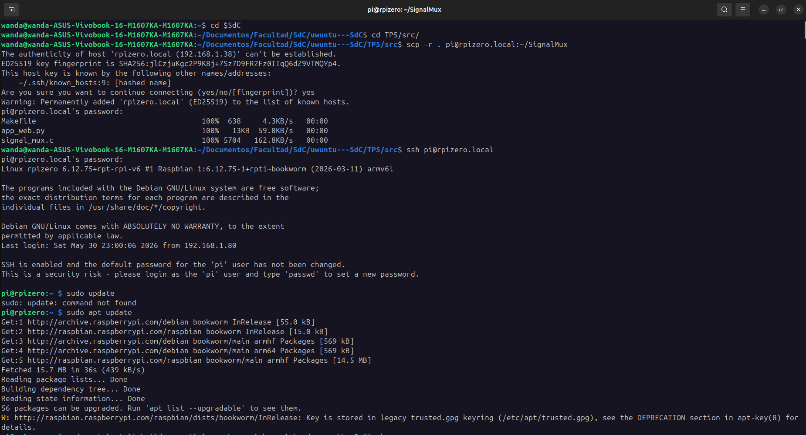
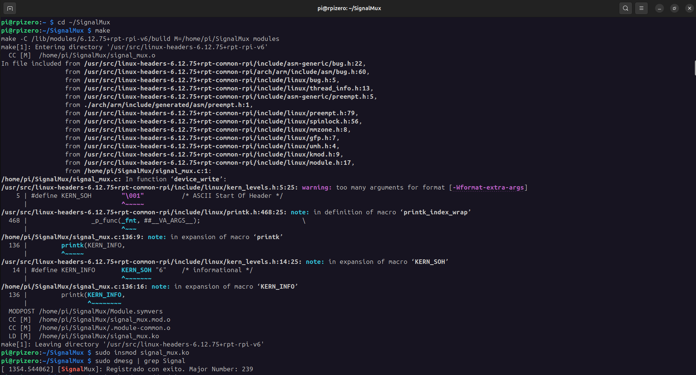
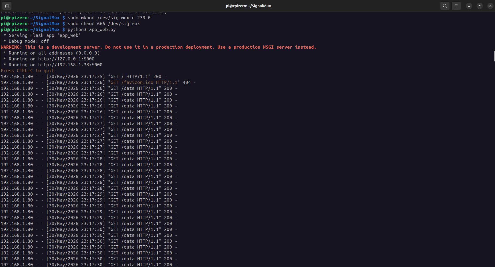
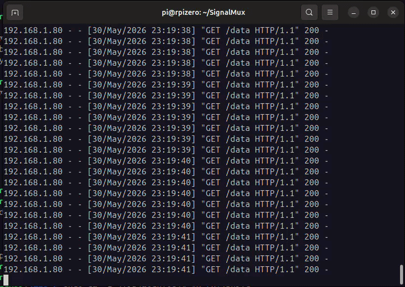
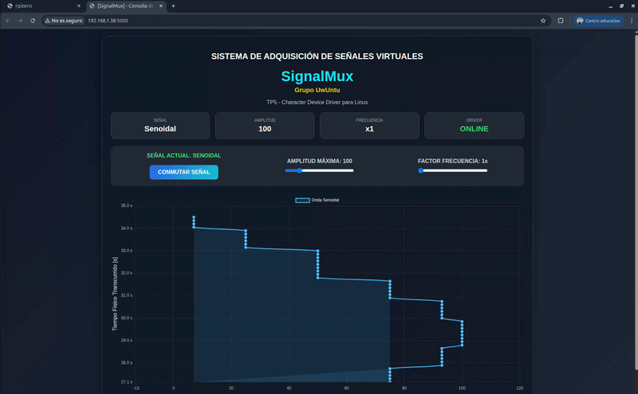
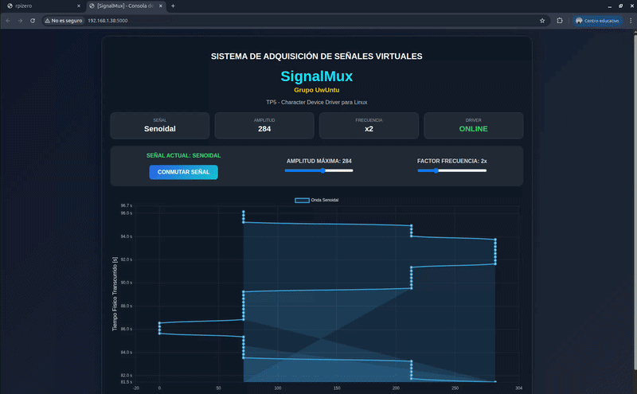

# TP5 - Character Device Driver para Sensado de Señales

El objetivo de este trabajo práctico fue diseñar e implementar un **Character Device Driver (CDD)** para Linux capaz de sensar dos señales virtuales diferentes y exponerlas al espacio de usuario mediante un archivo de dispositivo.

Sobre este controlador se desarrolló una aplicación de usuario que permite:

* Seleccionar la señal a visualizar.
* Modificar parámetros de la señal.
* Leer periódicamente las muestras generadas por el driver.
* Graficar las mediciones en tiempo real mediante una interfaz web.

La implementación se realizó utilizando una Raspberry Pi con Linux, aprovechando los mecanismos estudiados durante la materia para el desarrollo de módulos del kernel y dispositivos de caracteres.

---

## 1. Objetivos

### 1.1. Objetivo General

Desarrollar un sistema completo de adquisición y visualización de señales utilizando un Character Device Driver en Linux.

### 1.2. Objetivos Específicos

* Implementar un módulo del kernel.
* Registrar un dispositivo de caracteres.
* Utilizar operaciones `read()` y `write()`.
* Generar señales simuladas periódicamente.
* Utilizar Kernel Timers.
* Comunicar espacio kernel y espacio usuario.
* Construir una interfaz gráfica para monitoreo en tiempo real.

---

## 2. Marco Teórico

### 2.1. Character Device Drivers

Los Character Device Drivers permiten intercambiar información entre aplicaciones de usuario y el kernel mediante operaciones secuenciales de lectura y escritura.

A diferencia de los Block Device Drivers, los dispositivos de caracteres no requieren acceso aleatorio a posiciones de almacenamiento, sino que entregan un flujo de datos.

En Linux estos dispositivos aparecen normalmente bajo el directorio:

```bash
/dev/

```

Para este trabajo se creó el dispositivo:

```bash
/dev/sig_mux

```

---

### 2.2. Espacio de Usuario y Espacio Kernel

Linux separa estrictamente:

#### Kernel Space

Zona privilegiada donde se ejecuta el sistema operativo.

#### User Space

Zona donde se ejecutan las aplicaciones.

La comunicación entre ambos espacios se realizó mediante:

```c
copy_to_user()
copy_from_user()

```

Estas funciones permiten transferir datos de forma segura entre ambos contextos.

---

### 2.3. File Operations

El driver implementa las operaciones:

```c
.read
.write

```

#### read()

Permite obtener el valor instantáneo de la señal seleccionada.

#### write()

Permite configurar:

* Canal activo.
* Amplitud.
* Frecuencia.

mediante comandos enviados desde la aplicación web.

---

### 2.4. Kernel Timers

Para generar muestras periódicas se utilizó un Kernel Timer.

El temporizador ejecuta una función callback periódicamente encargada de:

* Actualizar la señal senoidal.
* Actualizar la señal cuadrada.
* Reprogramar la siguiente ejecución.

Conceptualmente:

```text
Timer
  ↓
Callback
  ↓
Actualización de señales
  ↓
Nueva programación

```

---

## 3. Diseño de la Solución

### 3.1. Arquitectura General

```text
┌─────────────────────┐
│ Navegador Web       │
└──────────┬──────────┘
           │ HTTP
           ▼
┌─────────────────────┐
│ Flask               │
└──────────┬──────────┘
           │
           │ Lectura/Escritura
           ▼
┌─────────────────────┐
│ /dev/sig_mux        │
└──────────┬──────────┘
           │
           ▼
┌─────────────────────┐
│ Character Driver    │
└──────────┬──────────┘
           │
           ▼
┌─────────────────────┐
│ Kernel Timer        │
└─────────────────────┘

```

---

## 4. Implementación y Entorno de Hardware

### 4.1. Plataforma de Desarrollo Real

Para la validación física de la solución se utilizó una plataforma embebida **Raspberry Pi Zero W** provista de un sistema operativo basado en Debian Linux.

La interconexión con la estación de trabajo (Notebook Asus) se realizó mediante un enlace de red virtual sobre un bus físico USB en modo *Gadget* (configurando los módulos `dwc2` y `g_ether` en la partición de arranque de la placa). Esto permitió energizar el sistema y, simultáneamente, establecer una interfaz de red con direccionamiento IP estático por enlace local (`169.254.X.X`), asegurando el control absoluto del entorno embebido vía SSH sin depender de una red externa.

---

### 4.2. Señal Senoidal

La señal senoidal se implementó utilizando una tabla precalculada:

```c
static const int sin_table[12]

```

Cada ejecución del temporizador avanza sobre la tabla obteniendo una aproximación discreta de una función seno. Esta discretización espacial de 12 pasos fijos, sumada a la tasa de refresco temporal del temporizador y la latencia en el transporte de datos, introduce una forma de onda escalonada (*steps*) visible en el analizador gráfico, la cual modela fielmente la cuantificación propia de un conversor digital-analógico (DAC) real.

La amplitud puede modificarse dinámicamente desde la aplicación web.

---

### 4.3. Señal Cuadrada

La señal cuadrada alterna entre:

```text
0
Amplitud configurada

```

simulando una onda digital.

---

### 4.4. Interfaz de Usuario

Se desarrolló una aplicación Flask que permite:

#### Conmutar señal

Entre:

* Senoidal
* Cuadrada

#### Modificar amplitud

Mediante un slider.

#### Modificar frecuencia

Mediante un slider configurable.

#### Visualización en tiempo real

Utilizando Chart.js.

---

## 5. Protocolo de Comunicación

El driver implementa comandos simples mediante escritura sobre el dispositivo.

### 5.1. Cambio de canal

```text
C0

```

Selecciona señal senoidal.

```text
C1

```

Selecciona señal cuadrada.

---

### 5.2. Cambio de amplitud

```text
A100

```

Configura amplitud 100.

---

### 5.3. Cambio de frecuencia

```text
F3

```

Configura frecuencia x3.

---

## 6. Cómo Ejecutar el Proyecto

### 6.1. Preparación del Entorno Embebido

Antes de compilar, es necesario dotar al sistema operativo de la Raspberry Pi de las herramientas de construcción de código nativas del kernel ejecutando:

```bash
sudo apt update
sudo apt install build-essential raspberrypi-kernel-headers python3-flask -y

```

### 6.2. Transferencia de Archivos (desde la PC Anfitriona)

Para inyectar el código fuente a la placa real a través del puente de red USB, ejecutar en la consola del sistema anfitrión:

```bash
scp -r . pi@rpizero.local:~/SignalMux

```

### 6.3. Compilar el Driver

Conectarse vía SSH a la Raspberry Pi, ingresar al directorio y compilar de forma nativa para su arquitectura ARM:

```bash
cd ~/SignalMux
make

```

---

### 6.4. Cargar el Módulo

```bash
sudo insmod signal_mux.ko

```

Verificar la correcta inserción y la asignación dinámica del identificador en el anillo de logs del kernel:

```bash
sudo dmesg | grep Signal

```

*Salida esperada:* `[SignalMux]: Registrado con exito. Major Number: 239`

---

### 6.5. Crear el Nodo de Dispositivo

Debido a que el registro del controlador de caracteres se realiza de forma dinámica en esta versión, el nodo en el sistema de archivos no se genera automáticamente. Debe construirse manualmente vinculándolo al Major Number reportado en el paso anterior (ej. `239`):

```bash
sudo mknod /dev/sig_mux c 239 0
sudo chmod 666 /dev/sig_mux

```

---

### 6.6. Ejecutar la Aplicación Web

```bash
python3 app_web.py

```

---

### 6.7. Abrir la Interfaz

Desde el navegador de la PC anfitriona, ingresar a:

```text
http://rpizero.local:5000

```

*(O utilizar en su defecto la dirección IP asignada a la interfaz del cable USB, por ejemplo `http://169.254.10.2:5000`)*.

---

## 7. Pruebas y Resultados

A continuacion se muestran los pasos realizados respecto a la configuracion para acceder a la Raspberry Pi Zero mediante SSH:



Ya con acceso a la Raspberry, se realiza la compilacion del CDD y su carga en el SO. En la siguiente imagen tambien se puede ver el major number designado:



Finalmente se levanta el servidor web para visualizar la grafica de las señales. Esto consiste tambien en la craciacion del archivo en `/dev` y su configuracion de permisos:



En la misma terminal se pueden ver los mensajes del servidor:



En las siguientes capturas de video se puede apreciar como se grafican las señales, asi como la respuesta de la pagina web cuando se conmuta entre señales o cuando se ocnfigura la amplitud o freceuncia de las graficas:




---

## 8. Conclusiones

Durante este trabajo práctico se aplicaron los conceptos fundamentales de desarrollo de controladores para Linux estudiados en la materia.

La implementación permitió comprender el funcionamiento interno de los Character Device Drivers, la interacción entre espacio de usuario y espacio kernel mediante llamadas seguras, el uso de Kernel Timers para emular la periodicidad de un reloj de hardware, y la construcción de una aplicación completa de adquisición y visualización de datos.

El despliegue final sobre una plataforma de hardware real basada en la **Raspberry Pi Zero W** permitió experimentar los desafíos técnicos verídicos del desarrollo embebido: la resolución de problemas de conectividad en la capa física, el aprovisionamiento de las cabeceras del kernel nativas de la arquitectura y la naturaleza discreta de las señales digitales obtenidas en el espacio de usuario. El sistema desarrollado logró integrar exitosamente un módulo del kernel con una interfaz gráfica, reproduciendo fielmente la arquitectura utilizada en la industria para sistemas de adquisición de datos y telemetría en tiempo real.